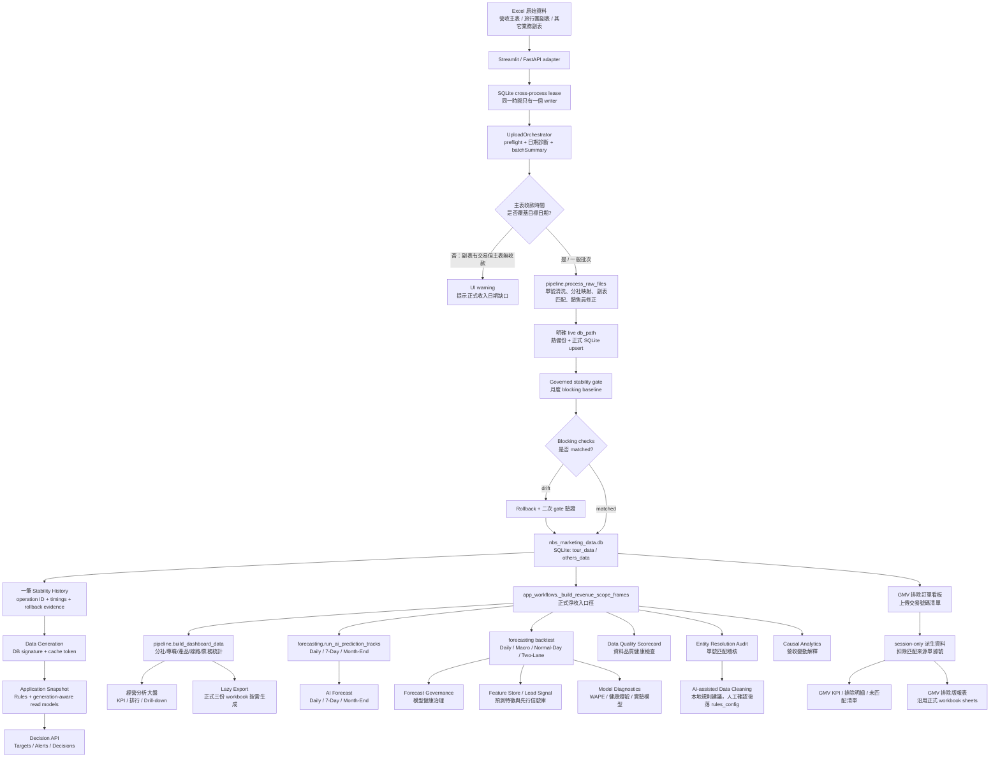

# NBS Analytics 系統全景地圖導航

更新日期：2026-07-14
專案路徑：`/Users/chanwaitung2025/Downloads/nbs_analytics`  
正式收入口徑：`不含掛賬核銷與TT退款轉團款`

目前正式版本節點：`main@ac40561`；P3-1 已在 `codex/p3-1-application-snapshot` 完成隔離驗收，尚未合併
最新正式資料：Acceptance Record `15`；最新日期 `2026-07-13`

---

## 1. 系統總覽

NBS Analytics 是一套本地企業營運駕駛艙：以 Streamlit 作為基準 cockpit UI、FastAPI 作為 Python API backend、Vue 作為漸進式前端、SQLite 做本地持久化、Pandas 做清洗與彙總、ARIMA / Prophet / LightGBM / Fusion 做 AI 預測與回測。

目前主畫面採三個 tab：

1. `經營分析大盤`：正式營收、分社/專職、產品下鑽、Data Quality、Entity Audit、AI Cleaning 建議、AI Forecast、Forecast Governance、Feature Store、Causal Analytics、Model Diagnostics、Export。
2. `業務規則配置`：分社代碼、排除前綴、專職銷售代表、郵輪部門、資料庫管理。
3. `GMV 排除訂單看板`：上傳交易號碼清單後，在 session 內扣除匹配訂單，產生獨立 GMV 視角與同規格報表。

核心原則：

- 正式經營分析使用 `不含掛賬核銷與TT退款轉團款` 的 analysis frames。
- SQLite 保存清洗後明細，不保存最終 dashboard 結果或 AI 模型物件。
- GMV 排除看板是 session-only 派生視角，不回寫 SQLite，不影響正式看板、AI Forecast 或 WAPE。
- 大型 Excel 匯出採 Lazy Export，首屏不再同步生成三份 workbook。
- 上傳新資料前會做日期來源診斷：主表 `收款時間` 是正式營收日期，副表 `交易時間` 不能替代正式收入日期。
- Data Quality、Entity Resolution、Forecast Governance、Feature Store、Causal Analytics 都是只讀診斷層，不回寫 SQLite，不覆蓋正式 AI Forecast。
- AI-assisted Data Cleaning 只提供本地智能建議；人工確認後才寫入 `rules_config.json` 支援的既有規則欄位。
- 上傳後的快速重建預設先跳過 AI / backtest 快取；需要補算時，使用者可在 AI Forecast 區手動按下「補算 AI」再做完整重建。
- Phase 2R 後，Streamlit 已拆成 thin entrypoint + page orchestration + workflow helpers；`app.py` 不再承擔大段 rendering 與業務 workflow。
- Phase 2I 啟動器統一管理 Streamlit / FastAPI / Vue；同專案既有服務佔用預設 port 時可被採納，不會誤判為未知程序。
- Streamlit 與 FastAPI 兩個正式上傳入口共用 `UploadOrchestrator`，並由 SQLite cross-process lease 保證同一時間只有一個 writer。
- 所有 preflight、正式 upsert、governed gate、rollback、history 與 cache generation 都綁定明確 `db_path`，不再暫時改寫 `database.DB_FILE`。
- 2026-01 至 2026-06 月度基準已全部升級為 blocking；目前六個月 checks 均 matched，2026-05 frozen baseline 維持 `HKD 12,057,968`。
- Acceptance history、upload operation ID 與 data generation signature 互相對應；Hermes 會把缺失或 signature mismatch 視為 degraded/fail。
- Decision API 透過 Application Snapshot service 固定 request-scoped generation，統一取得 Rules、Facts、Data Quality、Forecast、System Health 與 Target Config；HTTP router 不再自行編排 read models。

---

## 2. 全景流程圖



---

## 3. 模組導航

### 3.1 Streamlit UI 模組：thin entrypoint + pages + workflows

Phase 2R 後，Streamlit 不再由單一大型 `app.py` 承擔所有 rendering 與 workflow。現行邊界如下：

| 模組 | 職責 |
|---|---|
| `app.py` | Streamlit thin defensive entrypoint；保留 `st.set_page_config`、安全匯入、`main()` 調用與白屏防護。 |
| `app_pages.py` | 三個 tab、上傳區、經營大盤各 section、局部篩選、GMV 排除看板與業務規則配置的頁面編排。 |
| `app_workflows.py` | Streamlit upload adapter、日期診斷、cache、Data Quality、Entity Audit、Forecast Governance、Feature Store、Causal、Export 等 workflow helpers。正式 upload transaction 交由 backend orchestrator。 |
| `app_styles.py` | Streamlit CSS、深淺色 token、sidebar 與控制中心視覺樣式。 |
| `streamlit_rendering.py` | Sidebar navigation、section anchor、cards/table/chart shared renderer。 |

`app_pages.py` 對 `app_workflows.py` 已改為明確匯入清單，不再使用 `from app_workflows import *`。後續如果繼續拆模組，優先把 `streamlit_rendering` 的星號匯入也收斂成明確依賴。

重要入口：

- `app_pages._render_upload_area()`：收集主副表並交給 Streamlit upload adapter；busy path 在讀 Excel 前即被 shared lease 阻擋。
- `backend.services.upload_orchestrator_service.execute_upload_operation()`：兩個入口共用的正式 transaction；依序執行 preflight、upsert、governed gate、rollback、history 與 generation。
- `backend.services.upload_lock_service`：使用 `.nbs_runtime/upload_coordination.db` 的 SQLite exclusive lease 做跨 process single-writer coordination。
- `app_workflows._upload_date_source_diagnostics()`：比較主表 `收款時間` 與副表 `交易時間`，避免副表交易日期被誤認為正式收入日期。
- `backend.services.upload_preflight_service`：提供 upload preflight response contract；`batchSummary` 包含最早/最晚收款時間、金額合計與是否包含指定日期。
- `app_workflows._build_revenue_scope_frames()`：排除 `掛賬核銷` 與 `TT 退款轉團款` 的來源單據號，生成正式 analysis frames。
- `app_workflows._load_and_compute_cache()`：建立 dashboard facts、AI runtime outputs；大型 workbook 不在首屏同步生成。
- `app_workflows._load_and_compute_cache(include_ai=False)` 用於上傳完成後的快速重建；`include_ai=True` 則會完整補算 AI / backtest 快取。
- `_compute_data_quality_scorecard()`：從正式口徑與原始明細派生資料品質健康檢查，不寫入 SQLite。
- `_compute_entity_resolution_audit()`：稽核主表 `來源單據號` 與副表 `交易號碼` 匹配健康，副表-only 不進正式營收。
- `_compute_ai_cleaning_suggestions()`：根據異常、匹配與資料品質結果產生本地智能清洗建議，人工確認後才落既有規則。
- `_compute_forecast_governance()`：從 Daily / Macro backtest 派生模型治理分數，區分正式、診斷、實驗角色。
- `_compute_feature_store_lead_signals()`：整理 spike/event lead signals、日曆與動能特徵，檢查 `NoFutureLeak`。
- `_compute_causal_driver_analytics()`：按期間比較拆解營收變動 driver；是解釋型分析，不是嚴格因果。
- `SIDEBAR_NAV_GROUPS`：定義左側 submenu 分組、anchor、狀態 badge 與語義類型。
- `_render_sidebar_navigation()`：渲染頁內導覽；目前使用純 hash anchor，例如 `#section-ai-forecast`，避免用 `?nav=` 造成 Streamlit 重新整理。
- Sidebar 現在只保留 Navigation 與介面主題；資料篩選已移入主畫面並拆成 KPI 與門店/產品兩組局部 filter state。
- `app_pages._render_gmv_exclusion_tab()`：第 3 個 tab，讀交易號碼清單，扣除匹配 `來源單據號`，生成 GMV 派生視角。
- `_compute_export_workbooks()`：生成正式三份 workbook；GMV 排除版也沿用此 builder，只是輸入資料先被扣除訂單。

目前 tab：

```text
經營分析大盤
業務規則配置
GMV 排除訂單看板
```

### 3.2 `config.py`：業務規則與欄位常數

職責：

- 定義 `DB_FILE`、`CONFIG_FILE`、欄位常數。
- 提供預設分社 mapping、排除前綴、專職銷售代表、郵輪部門。
- 讀寫 `rules_config.json` 並初始化 Streamlit session state。

主要規則：

- `BRANCH_MAPPING`：來源單據號前綴到分社名稱。
- `EXCLUDE_PREFIXES`：入庫前排除的來源單據號前綴。
- `SALES_REP_LIST`：專職銷售代表名單。
- `CRUISE_DEPTS`：歸類為郵輪的團負責人部門。
- `BRANCH_REASSIGNMENT_OVERRIDES`：受限月份或指定訂單的分社歸屬 override；目前包含 2026-06 上環服務點至 `0A展覽會場專用` 的治理規則。

### 3.3 `pipeline.py`：Excel 清洗、匹配與報表生成層

職責：

- 讀取營收主表、旅行團副表、其它業務副表。
- 標準化 `來源單據號` / `交易號碼`。
- 用主表 `來源單據號` 左連副表 `交易號碼`。
- 生成 `df_tour_matched` 與 `df_others_matched`。
- 生成 dashboard summary 與完整 Excel workbook sheets。

核心規則：

- 主表是正式營收來源，日期以 `收款時間` 為準。
- 副表提供產品、交易、人數、銷售點等補充資訊，日期 `交易時間` 不替代正式收款日期。
- `tour_data` 條件：主副表匹配成功且副表資料來源為 `旅行團`。
- `others_data`：票務、其它業務、未匹配或非旅行團資料。
- `build_dashboard_data()` 產出完整 workbook 結構；GMV 排除報表沿用同一套 sheets。
- `分社經營統計_含銷售員` 按分社、銷售員與日期輸出旅行團/郵輪/票務金額、旅行團交易人數及票務交易數量；其金額與人數/數量需與對應正式 sheets 守恆。
- 分社 override 先按規則限制月份、來源分社與指定訂單，再同步套用到正式寫入與報表生成；不得用 dashboard 或 export formatting 補數。

### 3.4 `database.py`：SQLite 持久化與 Upsert 層

職責：

- 管理 SQLite 連線。
- 寫入前建立熱備份。
- 依 `來源單據號` 刪除舊資料再 append 新資料。
- 動態補欄，兼容來源 Excel 欄位演進。
- 提供既有 DB 歸屬修復功能。

資料庫檔案：

```text
nbs_marketing_data.db
```

主要表：

- `tour_data`：旅行團匹配成功資料。
- `others_data`：票務、其它業務、未匹配或非旅行團資料。
- `temp_ids`：upsert 刪舊時的技術輔助表。

目前正式實例狀態（2026-07-14 驗收）：

- `tour_data`：`6,676` 行。
- `others_data`：`22,571` 行。
- 最新正式資料日期：`2026-07-13`。
- 最新 acceptance：Record `15`，upload status `accepted`，rollback `not_required`。
- SQLite integrity：`ok`；data generation `2`，operation ID 與 Record 15 history matched，DB signature matched。

### 3.5 Upload Single-Writer 與治理服務

| 模組 | 職責 |
|---|---|
| `upload_action_service.py` | FastAPI adapter；取得 shared lease 後把 request 轉交 orchestrator。 |
| `upload_lock_service.py` | 建立 `UploadOperation` 與跨 process SQLite lease；busy 時不讀檔、不做 backup/preflight/history。 |
| `upload_orchestrator_service.py` | 唯一正式 upload transaction contract。 |
| `upload_preflight_service.py` | 在明確 temp DB 執行清洗、口徑及 stability 預演，不改全域 DB target。 |
| `monthly_baseline_service.py` | 評估六個月 blocking baseline、組合 governed gate、保存 promotion audit。 |
| `stability_history_service.py` | 每次 operation 保存一筆完整 acceptance、rollback、timings、monthly 與 generation evidence。 |
| `cache_generation_service.py` | 保存 generation、operation ID 與 DB SHA-256；promotion metadata write 後刷新 signature，但不額外增加 generation。 |
| `system_health_service.py` | 對照 lease、SQLite integrity、history、generation 與 DB signature，供 API/Hermes 監測。 |

### 3.6 Application Snapshot 與 Decision API

| 模組 | 職責 |
|---|---|
| `business_rules_service.py` | 將 Facts 使用的 branch mapping、target branches、cruise departments、sales reps 正規化為 request-scoped rules snapshot，並提供穩定 SHA-256 fingerprint。 |
| `application_snapshot_service.py` | 使用明確 DB/runtime/cache/config paths，固定 generation token，協調既有 Facts、Data Quality、Forecast、System Health 與 Target Config read models。 |
| `decision_service.py` | 根據 snapshot sources 建立 targets、alerts 與 management decision cards；既有 Facts/Forecast/Health provenance 保持 authoritative。 |
| `routers/decisions.py` | 薄 HTTP adapter；只建立 snapshot、呼叫 Decision Service，並把連續 generation conflict 映射為 HTTP 409。 |

一致性邊界：

- Dashboard Facts 與 Data Quality 使用同一 generation token；組裝結束時 token 改變會整段重試一次。
- generation 連續改變時不回傳混代 payload，而是回 HTTP 409。
- Forecast 目前仍使用獨立 AI cache，只回報 cache path/version/time/status；不得宣稱與 SQLite generation matched。
- Snapshot 不新增持久 cache、不直接讀 Pandas 明細、不重算正式收入，也不包含 Decision judgement。
- P3-1 最終驗收時 Decision API warm median 為 `232.346ms`，低於 `300ms` gate。

### 3.7 `forecasting.py`：AI 預測、回測與診斷層

正式 tracks：

- ARIMA
- Prophet
- LightGBM
- Fusion

正式展示：

- `Daily Forecast`：逐日波動預測。
- `7-Day Macro Forecast`：未來 7 日總額，不是自然週。
- `Month-End Macro Forecast`：MTD actual + 本月剩餘預測，不是未來 30 日加總。

診斷/實驗：

- Daily WAPE diagnosis。
- Baseline comparison。
- Normal-Day Tight Guardrail。
- Two-Lane Selector。
- Spike-aware lead signals。
- Event lead signal。
- Macro backtest summary。

目前狀態：

- Normal-Day 與 Two-Lane 只作診斷/實驗展示，不覆蓋正式 Daily Forecast。
- GMV 排除看板不影響 AI Forecast 與 WAPE，AI 仍使用正式口徑 analysis frames。
- Forecast Governance、Feature Store / Lead Signal 都從現有 backtest/cache 派生，不重訓、不改權重。
- 當 AI cache 被延後時，首頁仍會先顯示營運 dashboard；補算是使用者顯式操作，不會因為刷新頁面自動觸發。

### 3.8 `business_calendar.py`：香港日曆與旅遊展特徵層

職責：

- 載入 `data/business_calendar_events.json`。
- 展開香港公眾假期與旅遊展日期。
- 產生 LightGBM / spike 診斷使用的日曆特徵。

驗證：

```bash
.venv/bin/python scripts/validate_business_calendar.py
```

### 3.9 `visuals.py`：圖表視覺層

職責：

- Matplotlib 圖表渲染。
- 支援深淺色 theme token。
- 渲染 Daily / 7-Day / Month-End forecast 圖與基礎排行/占比圖。

---

## 4. SQLite 與資料生命週期

寫入生命週期：

```text
Excel 上傳
→ Streamlit / FastAPI adapter
→ shared cross-process lease
→ preflight temp DB + 日期來源診斷
→ governed blocking gate
→ live DB hot backup + upsert
→ post-write governed gate
→ matched：寫一筆 history + 推進 generation
→ drift：rollback + 二次 gate + history/generation evidence
→ release lease
```

讀取生命週期：

```text
Streamlit 啟動或刷新
→ 比對 data generation cache token
→ load_all_data_from_db()
→ normalize_runtime_columns()
→ _build_revenue_scope_frames()
→ dashboard summary / AI forecast / export / GMV derived view
```

正式口徑：

```text
正式收入資料
= SQLite 清洗後明細
  - 收款類型為「掛賬核銷」的來源單據號
  - 收款方式為「TT 退款轉團款」的來源單據號
```

GMV 排除口徑：

```text
GMV 排除後資料
= SQLite 清洗後明細
  - 使用者上傳交易號碼清單匹配到的來源單據號
```

注意：GMV 排除是第 3 個 tab 的 session-only 分析視角，不改正式 SQLite，不影響正式報表快取。

---

## 5. 三個 Dashboard Tab

### 5.0 左側 Navigation 與主畫面局部篩選

左側欄目前只處理導航與介面主題：

1. `Navigation`
   - 用於頁內快速跳轉，不負責篩選。
   - Submenu 分組包括 `Overview`、`Data Quality`、`AI Forecast`、`Governance`、`Advanced Analytics`、`Exports`。
   - 每個 menu item 連到頁內 section anchor，例如 `#section-data-quality`、`#section-seven-day-macro`。
   - Active 狀態由 CSS `:target` / `:has()` 判斷目前 hash section，不依賴 Streamlit rerun。
   - 狀態 badge 用於標示語義：`正式`、`只讀`、`稽核`、`人工確認`、`宏觀`、`回測`、`治理`、`診斷`、`解釋型`、`匯出`。

2. `介面主題`
   - 深色 / 淺色切換只影響 UI token，不改 SQLite、AI Forecast、WAPE 或 Export。

資料篩選已移到主畫面並拆成兩組互不污染的局部控制：

- `營運總覽與管理層 KPI 篩選`：只影響 KPI/營運總覽相關區塊。
- `門店與產品分析篩選`：只影響門店業績排行榜與產品佔比下鑽。
- 正式口徑、AI Forecast、治理、Export 與其它區塊不會被這兩組局部篩選偷偷重算。

Side menu 收合按鈕仍使用 Streamlit 原生 sidebar control，但 CSS 已調整到品牌區附近，與 `NBS Analytics` identity 保持水平對齊。這是 UI 層行為，不改任何資料流。

### 5.1 經營分析大盤

內容：

- 資料庫狀態與上傳入口。
- 左側 Navigation submenu 與介面主題。
- 營運總覽與管理層 KPI 局部篩選。
- 門店與產品分析局部篩選。
- Executive KPI。
- 年度總覽。
- 門店排行榜。
- 產品佔比下鑽。
- Data Quality Scorecard。
- Entity Resolution Audit。
- AI-assisted Data Cleaning 建議。
- Daily / 7-Day / Month-End AI Forecast。
- Forecast Governance。
- Feature Store / Lead Signal。
- Causal Analytics。
- Model Diagnostics。
- Lazy Export 下載中心。

### 5.2 業務規則配置

內容：

- 分社代碼與名稱映射。
- 專職銷售代表名單。
- 排除前綴。
- 郵輪部門。
- 清空資料庫危險操作。

### 5.3 GMV 排除訂單看板

內容：

- 上傳 Excel / CSV 排除清單。
- 優先讀取欄名 `交易號碼`，否則讀 A 欄。
- 交易號碼經 `clean_invoice_number()` 標準化。
- 與 SQLite 明細中的 `來源單據號` 匹配。
- 顯示排除清單筆數、成功匹配訂單數、未匹配訂單數、排除前 GMV、排除金額、排除後 GMV。
- 顯示被排除訂單明細與未匹配交易號碼。
- 生成 GMV 排除版完整報表與匹配稽核報表。

GMV 報表檔名：

```text
GMV排除訂單_分社與專職_經營統計_V5.0.xlsx
GMV排除訂單_分社與專職_經營統計_V5.0_不含掛賬核銷.xlsx
GMV排除訂單_分社與專職_經營統計_V5.0_不含掛賬核銷與TT退款轉團款.xlsx
GMV排除訂單_匹配稽核.xlsx
```

---

## 6. Excel 報表與 Sheet 導航

正式全維度報表由 `pipeline.build_dashboard_data()` 產出，GMV 排除版報表沿用同一套 workbook 結構。

主要 sheets：

| Sheet 名稱 | 用途 |
|---|---|
| 分社經營統計 | 分社每日旅行團/郵輪/票務收入 |
| 分社經營統計_含銷售員 | 分社、銷售員、日期層級的旅行團/郵輪/票務收入、旅行團交易人數與票務交易數量；總額與正式分社統計對齊 |
| 專職經營統計 | 專職每日旅行團/郵輪/票務收入 |
| 分社旅行團統計 | 分社旅行團交易人數 |
| 專職旅行團統計 | 專職旅行團交易人數 |
| 分社票務總計 | 分社票務交易數量 |
| 專職票務總計 | 專職票務交易數量 |
| 票務總計 | 全部票務交易數量 |
| 分社每天旅行團交易人數 | 分社每日旅行團/郵輪人數 |
| 專職每天旅行團交易人數 | 專職每日旅行團/郵輪人數 |
| 分社每天票務交易數量 | 分社每日票務數量 |
| 專職每天票務交易數量 | 專職每日票務數量 |
| NBS分社_旅行團金額統計 | 分社旅行團金額下鑽 |
| NBS分社_票務金額統計 | 分社票務金額下鑽 |
| 總表_多表匹配完成 | 統一明細表 |
| 旅行團_匹配成功 | 旅行團匹配明細 |
| 其它_未匹配_包含其它業務 | 票務/其它/未匹配明細 |
| 分社線路種類每天統計 | 分社線路每日人數與金額 |
| 專職線路種類每天統計 | 專職線路每日人數與金額 |

AI 報表：

- `4_AI淨營收多軌預報_不含掛賬核銷與TT退款轉團款.xlsx`
- `模型回測評分報表_不含掛賬核銷與TT退款轉團款.xlsx`

獨立診斷報表：

- `Data_Quality_Scorecard_不含掛賬核銷與TT退款轉團款.xlsx`
- `Entity_Resolution_Audit_不含掛賬核銷與TT退款轉團款.xlsx`
- `AI_Assisted_Data_Cleaning_智能清洗建議_不含掛賬核銷與TT退款轉團款.xlsx`
- `Forecast_Governance_模型健康治理_不含掛賬核銷與TT退款轉團款.xlsx`
- `Feature_Store_Lead_Signal_不含掛賬核銷與TT退款轉團款.xlsx`
- `Causal_Analytics_Driver_Explanation_不含掛賬核銷與TT退款轉團款.xlsx`

---

## 7. 快取與效能

AI cache：

- 位置：`.nbs_runtime_cache`
- 目的：避免每次開頁重新跑 rolling backtest 與 forecast tracks。
- 可用 `scripts/prewarm_ai_cache.py --status` 檢查。
- 若上傳後先走快速重建，cache 可能暫時顯示 deferred；需要完整重算時，請回到 Streamlit AI Forecast 區手動按「補算 AI」。

Data generation：

- 位置：`.nbs_runtime/data_generation.json`。
- accepted upload 或 verified rollback 推進 generation；保存 operation ID 與正式 DB signature。
- Streamlit 以 `generation:sha256` cache token 判斷 session cache 是否失效。
- 月度 baseline promotion 會寫 governance audit，因此完成後刷新 signature，但不把同一批 upload 誤算成新 generation。

Export cache：

- 正式三份大型 workbook 採 Lazy Export。
- 首屏只載入 dashboard 和 AI 必要資料。
- 需要下載時才生成/載入 workbook bytes。

GMV 排除報表：

- 不使用正式 export cache。
- 因為排除清單是 session-only，報表按需即時計算，避免污染正式快取。

只讀診斷報表：

- Data Quality、Entity Resolution、AI Cleaning、Forecast Governance、Feature Store、Causal Analytics 的 workbook 都是按需生成。
- 這些 workbook 不改正式三份 export 的檔名、sheets 或 cache key。
- Feature Store 與 Causal Analytics 依賴既有 cache / analysis frames，不重訓、不寫 DB。

---

## 8. 稽核與排查

常用命令：

```bash
.venv/bin/python -m py_compile app.py app_pages.py app_workflows.py app_styles.py streamlit_rendering.py forecasting.py pipeline.py business_calendar.py scripts/validate_business_calendar.py visuals.py backend/services/upload_preflight_service.py scripts/system_manager.py
.venv/bin/python scripts/validate_business_calendar.py
.venv/bin/python scripts/inspect_sqlite_latest.py
.venv/bin/python scripts/prewarm_ai_cache.py --status
.venv/bin/python scripts/system_manager.py acceptance
.venv/bin/python scripts/monthly_baseline_check.py
.venv/bin/python scripts/hermes_post_change_check.py --json
.venv/bin/python -m pytest -q
```

上傳日期排查：

- 若副表有某日 `交易時間`，但主表沒有同日 `收款時間`，正式營收看板不會新增該日收入。
- 正式收入日期以主表 `收款時間` 為準。
- 副表 `交易時間` 只作交易/產品/數量補充，不替代收款日期。
- 2026-06-15 目前已存在於正式 SQLite；若未來 UI 顯示缺日，先檢查 preflight `batchSummary` 欄位，而不是直接判定 SQLite 缺資料。

資料庫備份：

```text
nbs_marketing_data.db.backup_YYYYMMDD_HHMMSS
```

任何 upsert 或修復前會熱備份。

Baseline drift 排查順序：

1. upload operation ID / shared lease owner；
2. 明確 live DB path、upsert summary 與 hot backup；
3. governed monthly blocking gate、rollback 與 post-rollback gate；
4. stability history、data generation signature 與 quarantine；
5. 最後才檢查 dashboard / export rendering，禁止用顯示層掩蓋 drift。

---

## 9. 目前限制與後續方向

已知限制：

- Daily WAPE 仍偏高，Daily Forecast 適合作短期風險參考。
- Normal-Day Tight Guardrail 與 Two-Lane Selector 仍是診斷/實驗，不覆蓋正式 forecast。
- GMV 排除清單目前不持久化，重開 session 需重新上傳。
- SQLite 仍是本地單機資料庫，未做多人權限與 schema migration 管理。
- Streamlit rerun / page-load hot path 仍有約 12–15 秒固定等待需要以 profiling 重新定位；這是 P1 效能範圍，不得改動 P0 single-writer 或 baseline contract。

P3 後續方向：

- P3-2 建立 Read Model Registry，統一 cache key、schema version、checksum、命中狀態與失效策略。
- P3-3 將 Forecast、Export 與完整 rebuild 改為可追蹤 background jobs，避免同步 request 長時間等待。
- P3-4 抽象 Governance Repository，再按實際查詢與 transaction 需求評估 JSON/JSONL 遷移 SQLite。
- P3-5 加入 request ID、operation ID、generation token、階段耗時與慢查詢 observability。
- 後續 consumer 只可逐個接入 Application Snapshot/API，不可一次重寫 Streamlit、Dashboard API 與 Vue。
- 驗收 GMV 排除訂單看板的真實業務清單與報表 sheets。
- 持續優化 Daily WAPE，但保持正式 forecast 與診斷模型分離。
- 以 Feature Store / Lead Signal 的 `NoFutureLeak` 與 readiness matrix 作為下一輪 Daily WAPE 實驗入口。
- 深化 Causal Analytics，從目前 driver decomposition 擴展到可選期間與事件窗口對比。
- Windows / VS Code / NVIDIA GPU 環境下做模型實驗，結果再回寫文檔。
- 評估 SQLite index、`temp_ids` 清理、DB health report。

---

## 10. 結論

目前 NBS Analytics 的資料鏈路是：

```text
Excel → shared lease → preflight temp DB → 清洗匹配 → live SQLite upsert → governed gate / rollback → history + generation → 正式淨口徑 → Dashboard / Forecast / Export / GMV 派生視角
```

任何後續修改都應先確認六個邊界：

1. 是否改 SQLite 明細。
2. 是否改正式收入口徑。
3. 是否影響 AI Forecast / WAPE。
4. 是否只是 session-only 派生視角。
5. 是否繞過 single-writer、明確 DB path、rollback 或 history/generation contract。
6. 是否仍保持 2026-01 至 2026-06 blocking checks matched，尤其 2026-05 `HKD 12,057,968`。

只要這六個邊界清楚，系統就能繼續保持穩定、可驗證、可擴展。
