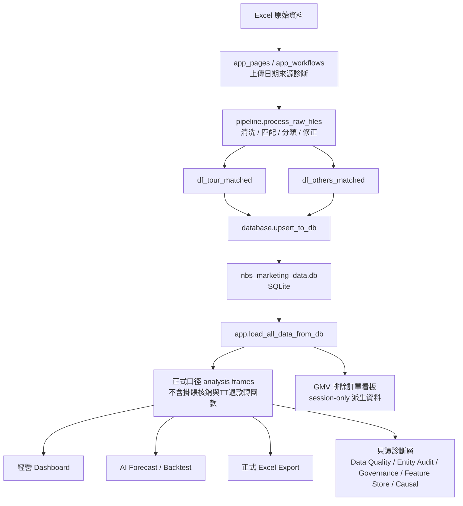

# NBS Analytics SQLite 資料庫設計與運行指南

更新日期：2026-06-30  
資料庫檔案：`/Users/chanwaitung2025/Downloads/nbs_analytics/nbs_marketing_data.db`  
相關程式：`database.py`、`pipeline.py`、`app.py`、`app_pages.py`、`app_workflows.py`、`backend/services/upload_preflight_service.py`、`config.py`

---

## 1. 一句話理解這個 SQLite

這個 SQLite 是 NBS Analytics 的本地輕量級營銷數據倉儲。它保存的是**清洗後明細資料**，不是最終 dashboard 結果，也不是 AI 模型結果。

白話模型：

```text
Excel 是原材料
pipeline.py 是清洗加工車間
SQLite 是本地倉庫
app.py 是 Streamlit thin entrypoint
app_pages.py / app_workflows.py 是前台看板與 workflow 拆分層
forecasting.py 是 AI 預測與回測引擎
```

SQLite 的工作：

- 累積每次上傳後的清洗明細。
- 支援重複上傳時依 `來源單據號` upsert。
- 讓 dashboard 不必每次重新解析 Excel。
- 為正式營收、AI 預測、GMV 派生視角提供底層明細。

SQLite 不做：

- 不保存 dashboard 篩選狀態。
- 不保存 GMV 排除清單。
- 不保存 AI 模型物件。
- 不保存最終正式口徑聚合表。
- 不保存 Data Quality、Entity Resolution、Forecast Governance、Feature Store 或 Causal Analytics 的派生結果。
- 不保存 AI-assisted Data Cleaning 建議；人工確認後只會更新 `rules_config.json` 支援的既有規則。

---

## 2. SQLite 在系統中的位置



邊界：

- SQLite 保存清洗後明細。
- 正式收入口徑在 `app.py` 讀出後派生。
- GMV 排除看板在第 3 個 tab 以 session-only 方式派生，不寫回 SQLite。
- Data Quality、Entity Audit、Forecast Governance、Feature Store、Causal Analytics 只讀取 SQLite 派生診斷結果，不寫回 SQLite。
- AI-assisted Data Cleaning 未確認前只是建議；確認後只更新 `rules_config.json`，下一次清洗/載入時由既有規則生效。
- `.nbs_runtime_cache` 保存 AI/export runtime cache，不屬於 SQLite。

---

## 3. 目前資料庫實例狀態

2026-06-30 本機狀態：

| 表名 | 角色 | 狀態 | 最新收款時間 | Row count |
|---|---|---|---|---:|
| `tour_data` | 旅行團匹配成功資料 | 存在 | `2026-06-29 19:08:12` | 6,338 |
| `others_data` | 票務、其它業務、未匹配或非旅行團資料 | 存在 | `2026-06-29 18:02:39` | 21,578 |
| `temp_ids` | upsert 技術輔助表 | 可能存在 | 非業務表 | 不作業務統計 |

重要說明：

- `tour_data` 和 `others_data` 是正式業務明細表。
- `temp_ids` 是 `_delete_existing_ids()` 用來刪舊資料的輔助表，不應當成業務資料。
- 系統不使用 DB primary key，而是靠程式以 `來源單據號` 做刪舊再追加。
- 2026-06-15 已存在於正式 SQLite；近期「未解析到 2026-06-15」屬 upload preflight 顯示 contract false warning，不代表 DB 缺少該日。

最新狀態可用：

```bash
.venv/bin/python scripts/inspect_sqlite_latest.py
```

---

## 4. 表設計

### 4.1 設計思想

SQLite 採寬表明細設計，而不是星型模型。

沒有拆成：

```text
fact_sales
dim_branch
dim_product
dim_salesperson
dim_calendar
```

而是直接保存兩張清洗後寬表：

```text
tour_data
others_data
```

好處：

- 本地 dashboard 讀取簡單。
- 保留原始欄位，方便追溯。
- 新月份可直接 append。
- 非工程使用者容易查明細。

代價：

- 沒有嚴格 DB 約束。
- 欄位語義靠 `pipeline.py`、`config.py` 與文檔維護。
- 若來源 Excel 欄位變化，需要補 alias 或清洗規則。

### 4.2 `tour_data`

用途：保存主表與旅行團副表匹配成功後的旅行團資料。

判斷：

```text
_merge == both
且 資料來源 == 旅行團
```

核心欄位：

- `來源單據號`：upsert 與跨表排除的核心業務識別。
- `收款時間`：正式營收日期來源。
- `收款原幣金額`：dashboard 主要收入金額。
- `收款類型`：正式口徑排除 `掛賬核銷`。
- `收款方式`：正式口徑排除 `TT 退款轉團款`。
- `銷售點`：分社或專職銷售組。
- `銷售員`：銷售代表。
- `交易時間`：副表交易日期，不能替代正式收款日期。
- `團負責人部門`：判斷郵輪的重要欄位。
- `統一日期`：dashboard 與 AI 時間序列使用的統一日期。

### 4.3 `others_data`

用途：保存非旅行團資料，包括票務、其它業務、未匹配或非旅行團來源。

判斷：

```text
不是 tour_data 條件的記錄
→ 寫入 others_data
```

使用方式：

- `數量` 在票務分析中被視為 `交易數量`。
- `團名稱`、`目的地名稱`、`來源報表標籤` 會被 `map_ticket_category()` 用來判斷票務種類。
- `來源報表標籤` 對未匹配或其它業務辨識很重要。

### 4.4 `temp_ids`

用途：upsert 時暫存本次上傳的 `來源單據號`。

流程：

```text
DataFrame 來源單據號
→ to_sql("temp_ids", if_exists="replace")
→ DELETE FROM target_table
   WHERE 來源單據號 IN (SELECT 來源單據號 FROM temp_ids)
```

`temp_ids` 不是業務表，後續可考慮改為 temporary table 或 upsert 後 drop。

---

## 5. 寫入流程：Upsert 如何運行

### 5.1 上傳前日期來源診斷

上傳流程會先做 preflight：

- 主表檢查 `收款時間`。
- 副表檢查 `交易時間`。
- 顯示每個檔案行數、最大日期、目標日期行數、主表金額合計。
- `batchSummary` 顯示清洗後可寫入批次的最早收款時間、最晚收款時間、金額合計，以及是否包含指定日期。

關鍵規則：

```text
正式營收日期 = 主表收款時間
副表交易時間 = 交易補充資訊，不能替代正式收入日期
```

典型排查：

```text
副表有 2026-06-15 交易
但主表沒有 2026-06-15 收款
→ dashboard / export 不會新增 6/15 正式收入
→ 系統會 warning，提示正式收入日期缺口
```

截至 2026-06-30，正式 SQLite 已包含 2026-06-15；如果 UI 再出現「本次清洗後批次未解析到 2026-06-15」，先展開上傳預演結果檢查 `batchSummary`，不要直接判斷為 SQLite 或 dashboard 漏日。

### 5.2 Upsert 總流程

```text
使用者上傳 Excel
→ 日期來源診斷
→ pipeline.process_raw_files()
→ df_tour_matched / df_others_matched
→ database.upsert_to_db()
→ hot_backup_database()
→ _delete_existing_ids("tour_data", df_tour)
→ _append_compatible("tour_data", df_tour)
→ _delete_existing_ids("others_data", df_others)
→ _append_compatible("others_data", df_others)
→ commit
```

### 5.3 熱備份

每次寫入前會複製：

```text
nbs_marketing_data.db.backup_YYYYMMDD_HHMMSS
```

用途：

- 防止錯誤上傳造成不可逆損失。
- 支援人工回復。
- 讓批量修復和 upsert 有安全網。

### 5.4 刪舊與追加

刪舊依據：

```text
來源單據號
```

不是：

- 收款單號
- 交易號碼
- 收款流水號
- SQLite rowid

原因：`來源單據號` 是主副表合併後保留下來的核心業務識別，最適合做重複上傳去重。

追加由 `_append_compatible()` 負責：

1. 表不存在時直接建立。
2. 新資料多出的欄位會 `ALTER TABLE ADD COLUMN`。
3. 舊表有但新資料缺少的欄位會補 `None`。

---

## 6. 讀取流程：Dashboard 如何使用 SQLite

```text
load_all_data_from_db()
→ normalize_runtime_columns()
→ _build_revenue_scope_frames()
→ build_dashboard_data()
→ run_ai_prediction_tracks()
→ run_ai_backtest_report()
→ run_ai_macro_backtest_report()
```

SQLite 只提供明細。以下內容都在 Python 層派生：

- 正式口徑。
- 分社/專職 KPI。
- 產品分類。
- AI Forecast。
- WAPE backtest。
- Data Quality Scorecard。
- Entity Resolution Audit。
- Forecast Governance。
- Feature Store / Lead Signal。
- Causal Analytics。
- AI-assisted Data Cleaning 建議。
- GMV 排除訂單看板。
- Excel workbook bytes。
- Sidebar Navigation / Control Center UI 狀態。

左側 side menu 的 submenu、active highlight、狀態 badge、收合按鈕位置都屬於 Streamlit / CSS UI 層。它們不讀寫 SQLite，也不會改變 `tour_data`、`others_data` 或 `temp_ids`。

Control Center 的篩選條件是在 app 讀取 SQLite 後，對 Python DataFrame 套用視角；它不是 SQLite schema，也不是持久化設定。

---

## 7. 正式收入口徑

SQLite 內保存的是完整清洗後明細，不等於正式分析口徑。

正式口徑：

```text
不含掛賬核銷與TT退款轉團款
```

排除規則：

```text
排除收款類型 == 掛賬核銷 的來源單據號
排除收款方式 == TT 退款轉團款 的來源單據號
```

注意：系統是按 `來源單據號` 整單排除，而不是只排除單筆收款行。

---

## 8. GMV 排除訂單與 SQLite 的關係

GMV 排除訂單看板不改 SQLite。

流程：

```text
第 3 個 tab 上傳交易號碼清單
→ clean_invoice_number()
→ 交易號碼 對 SQLite 明細 來源單據號
→ 在記憶體中扣除匹配訂單
→ 顯示 GMV KPI / 排除明細 / 未匹配清單
→ 按需生成 GMV 排除版完整報表
```

設計邊界：

- 排除清單只存在 `st.session_state`。
- 不新增 DB table。
- 不回寫 `tour_data / others_data`。
- 不影響正式經營大盤。
- 不影響 AI Forecast / WAPE。
- 不污染正式 export cache。

GMV 排除版報表沿用原本正式 workbook sheets，只是生成前先扣掉排除訂單。

---

## 9. 業務規則如何影響 SQLite

業務規則保存於：

```text
rules_config.json
```

預設來自：

```text
config.py
```

### 9.1 分社代碼映射

```text
來源單據號前綴 → 分社名稱
```

`pipeline.process_raw_files()` 會根據前綴產生 `銷售點`。

### 9.2 排除前綴

`EXCLUDE_PREFIXES` 是入庫前排除；它不同於正式收入排除。

```text
EXCLUDE_PREFIXES = 入庫前排除
掛賬核銷 / TT 退款轉團款 = 入庫後分析口徑排除
```

### 9.3 專職銷售代表

根據 `收款操作員` 匹配專職銷售代表，命中後：

```text
銷售點 = 營銷運營中心-專職銷售組
銷售員 = 標準專職姓名
```

### 9.4 郵輪部門

如果：

```text
團負責人部門 ∈ CRUISE_DEPTS
```

則該旅行團收入在 dashboard 中歸為 `郵輪`。

### 9.5 AI-assisted Data Cleaning 建議

`AI-assisted Data Cleaning` v1 不接外部 LLM，也不直接改 SQLite。它從現有 anomaly、Data Quality、Entity Audit 與規則缺口中產生本地智能建議。

允許人工確認後落地的類型限於既有 `rules_config.json` 欄位：

- `EXCLUDE_PREFIXES`
- `SALES_REP_LIST`
- `BRANCH_MAPPING`
- `CRUISE_DEPTS`

設計邊界：

- 未勾選 / 未確認的建議不生效。
- 建議不會直接修改 `tour_data / others_data`。
- 若規則更新，需要重新載入或重新清洗，才會反映到新派生結果。

---

## 10. 維護與排查指南

### 10.1 最新 DB 狀態

```bash
.venv/bin/python scripts/inspect_sqlite_latest.py
```

用途：

- 檢查 `tour_data / others_data` 是否存在。
- 檢查 row count、最大 `收款時間`、近 10 日金額。
- 對照最新 backup。

### 10.2 日曆特徵驗證

```bash
.venv/bin/python scripts/validate_business_calendar.py
```

### 10.3 AI cache 狀態

```bash
.venv/bin/python scripts/prewarm_ai_cache.py --status
.venv/bin/python scripts/prewarm_ai_cache.py
```

補充：

- 上傳後的 dashboard 快速重建可先不重算 AI cache。
- 若需要立即更新 AI / backtest 結果，請在 Streamlit AI Forecast 區按下「補算 AI」按鈕。
- AI cache 是否已補算，只影響預測與回測快取，不會改 SQLite 已入庫明細。

### 10.4 Lazy Export 狀態

正式三份大型 workbook 採用 Lazy Export：SQLite 只提供明細與分析事實來源，報表 bytes 由 `app_pages.py` / `app_workflows.py` 按需生成或從 `.nbs_runtime_cache` 讀取，不寫回 SQLite，也不改變 `tour_data / others_data`。

### 10.5 只讀診斷 workbook

以下 workbook 都是 Streamlit workflow 從目前 SQLite 明細、正式 analysis frames 或 AI cache 派生，不寫入 SQLite，也不改正式 export：

```text
Data_Quality_Scorecard_不含掛賬核銷與TT退款轉團款.xlsx
Entity_Resolution_Audit_不含掛賬核銷與TT退款轉團款.xlsx
AI_Assisted_Data_Cleaning_智能清洗建議_不含掛賬核銷與TT退款轉團款.xlsx
Forecast_Governance_模型健康治理_不含掛賬核銷與TT退款轉團款.xlsx
Feature_Store_Lead_Signal_不含掛賬核銷與TT退款轉團款.xlsx
Causal_Analytics_Driver_Explanation_不含掛賬核銷與TT退款轉團款.xlsx
```

### 10.6 檢查正式口徑排除資料

```sql
SELECT 收款類型, 收款方式, COUNT(*), SUM(收款原幣金額)
FROM others_data
GROUP BY 收款類型, 收款方式
ORDER BY COUNT(*) DESC;
```

完整排查需同時查 `tour_data` 和 `others_data`。

### 10.7 清空資料庫

UI 提供危險操作入口，也可用：

```python
clear_database()
```

會 drop：

```text
tour_data
others_data
temp_ids
```

---

## 11. 常見問題

### Q1：為什麼副表有某天交易，但看板沒有同日收入？

因為正式收入日期看主表 `收款時間`。副表 `交易時間` 不能替代正式收款日期。

補充：2026-06-15 目前已存在於正式 SQLite；若看到 6/15「未解析到」提示，先看 upload preflight `batchSummary` 是否缺欄或顯示異常。

### Q2：為什麼 SQLite 裡有 `temp_ids`？

它是 upsert 刪舊用的技術輔助表，不是業務表。

### Q3：為什麼沒有 primary key？

一個 `來源單據號` 可能有多筆收款或明細。直接設 primary key 會誤殺合法多行。

### Q4：正式收入為什麼不是直接存在 SQLite？

SQLite 保存完整清洗明細。正式口徑是在 app 讀出後根據 `來源單據號` 整單排除派生。

### Q5：GMV 排除訂單會改 DB 嗎？

不會。它只在第 3 個 tab 的 session 中產生派生資料。

### Q6：AI 預測結果存在 SQLite 嗎？

目前沒有。AI 預測與回測結果保存在 runtime cache 或即時計算，不寫入 SQLite。若上傳後先走快速重建，AI/backtest cache 可能會暫時標記為 deferred；此時需要在 Streamlit 的 AI Forecast 區手動按下「補算 AI」才會完整重算快取。

### Q7：Feature Store / Causal Analytics 會新增資料表嗎？

不會。v1 只是只讀派生視角：Feature Store 整理既有 lead signal 與 `NoFutureLeak` 狀態；Causal Analytics 做期間 driver decomposition。兩者都不新增 SQLite table。

### Q8：AI-assisted Data Cleaning 會自動清洗資料嗎？

不會。它只產生建議；只有使用者勾選並套用後，才會寫入 `rules_config.json` 的既有規則欄位。已入庫明細不會被它直接改寫。

### Q9：左側 side menu 的 active 狀態會改 SQLite 嗎？

不會。Side menu 的 `Navigation` 只用 hash anchor 做頁內跳轉，例如 `#section-data-quality`。Active 狀態由 CSS 根據目前目標 section 顯示，不會觸發 SQLite 寫入，也不會重新計算正式口徑。

### Q10：Control Center 和 Navigation 有什麼差別？

`Navigation` 是頁內目錄，負責跳到 Data Quality、AI Forecast、Export 等區塊；`Control Center` 是提交式篩選器，負責年份、月份、日期、分社、專職與主題。只有 Control Center 的篩選會改變當前分析視角。

---

## 12. 風險與改進建議

短期：

- upsert 後 drop `temp_ids` 或改用 temporary table。
- 為 `tour_data.來源單據號` 和 `others_data.來源單據號` 建 index。
- 補 DB health report，定期輸出行數、最大日期、排除金額。

中期：

- 建立 `db_audit_log`，記錄每次上傳、備份、刪除、追加。
- 建立正式口徑 audit snapshot，方便追蹤每次排除結果。
- 將 GMV 排除清單增加「可選保存」模式，但預設仍 session-only。
- 若未來要追蹤資料品質趨勢，可另建只讀 audit snapshot 或獨立歷史表；v1 暫不持久化。

長期：

- 拆出 fact / dimension schema。
- 將 SQLite 升級到 DuckDB 或 Postgres，支援更大資料與多人協作。
- 評估 Feature Store 持久化，但必須先定義 grain、版本、NoFutureLeak 規則與回測使用邊界。

---

## 13. 最重要的資料庫心智模型

```text
SQLite 保存清洗後明細，
正式口徑、GMV 排除、AI Forecast、WAPE 回測，
都是從 SQLite 明細讀出後，在 Python 層派生。
```

排查順序：

```text
1. SQLite 是否有明細？
2. 主表收款時間是否覆蓋目標日期？
3. 來源單據號是否重覆或被 upsert 覆蓋？
4. 正式口徑是否排除了該單？
5. 分社 / 專職 / 郵輪 / 票務分類是否正確？
6. 目標看板是正式口徑還是 GMV 派生視角？
7. 目標結果是正式營收、只讀診斷、AI cache，還是 session-only 派生？
```
