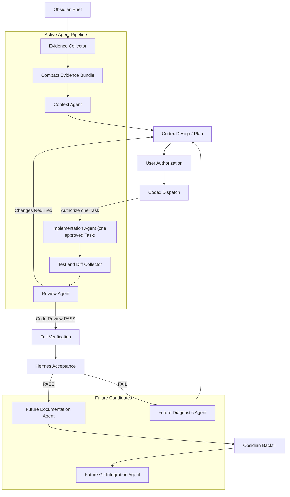

# NBS Agent Architecture

狀態：active
版本：v1.1 Evidence Bundle and Implementation Pipeline
日期：2026-07-15

## 1. 文件目的

本文件定義 NBS Analytics 的 Agent 協作架構。目前已建立 Context Agent、Review Agent 與受控 Implementation Agent；本地 Evidence Collector 先收集、裁剪及指紋化證據，再由 LLM 做有限範圍的上下文壓縮、單一批准 Task 實作與 code review。

這套架構的目的不是增加更多自主代理，而是減少主 Codex 重複讀取 repo、文件、diff 與測試輸出的 Token，同時維持 frozen baseline、正式口徑、Git、Hermes 與人工授權治理。

## 2. 現有流程與問題

目前正式修改流程為：

```text
Obsidian Brief
  -> Codex 規劃
  -> 使用者授權
  -> Codex 修改與測試
  -> Hermes read-only 驗收
  -> Obsidian 回填
  -> ADR / Incident / Git 版本沉澱
```

主要 Token 成本來自：

1. 每個新任務重新讀取相同的系統總覽、ADR、handoff 與 baseline 文件。
2. 為定位相關模組而掃描過多檔案。
3. 修改後再次把整個 diff、測試輸出與 runtime log 送入主對話。
4. Context、code review 與系統驗收的責任未被機器可讀契約分開。

## 3. 設計目標

- 以純本地 Collector 完成可確定的搜尋、裁剪、fingerprint 與 telemetry，不消耗 LLM Token。
- Context Agent 只輸出規劃所需的最小上下文。
- Review Agent 只檢查已批准需求、實際 diff、測試證據與風險。
- Hermes 繼續負責 runtime、SQLite、baseline、服務、Git 與整體驗收。
- Context Agent 與 Review Agent 維持 read-only；Implementation Agent 只可在已批准的單一 Task contract 與獨立 worktree 內做 allowlisted 修改。
- Agent 失效時，Codex 可直接使用 Evidence Bundle 繼續工作。

## 4. 明確非目標

目前已驗收階段不建立：

- 可自行選擇 Task、越過 Review、完整驗證或 Hermes 的自主 Implementation Agent。
- 自動 commit、merge、rollback 或 baseline promotion。
- 向量資料庫或長駐索引服務。
- Agent Web UI 或新的 FastAPI endpoint；Streamlit Agent Operations 是 Phase 2 的 read-only 工作，不得成為 dispatch、approval 或 retention 的寫入入口。
- 對正式 SQLite、營銷原始資料、業務規則或報表計算的變更。
- Hermes 的替代品或第二套完整系統驗收器。
- 自動選擇或購買外部模型。

## 5. Agent 全景流程



## 6. Responsibility Matrix

| 角色 | 主要責任 | 不負責 |
|---|---|---|
| Evidence Collector | 白名單讀取、搜尋、裁剪、fingerprint、telemetry | 語意判斷、tracked source 修改、正式驗收 |
| Validation Runner | 執行已批准 compile、tests、verify/build，保存精簡結果 | 修復失敗、放寬 gate、寫入正式資料 |
| Context Agent | 任務理解、相關檔案、依賴、風險、建議測試 | 修改程式、執行完整驗收、判定正式 baseline |
| Codex | 建立/批准 Task contract、分派單一 Task、檢查 report 與 diff、處理 findings、完整驗證、Hermes 與整合 | 把未驗證輸出當成完成證據 |
| Implementation Agent | 在獨立 worktree 內執行一個已批准 allowlisted Task，提交 final implementation report 與實際 diff | 決定下一 Task、commit、merge、push、正式 SQLite、baseline、rollback、完整驗證或 Hermes |
| Review Agent | requirement coverage、diff findings、測試缺口、residual risk | 修改檔案、取代 Hermes、正式 baseline 裁決 |
| Hermes | runtime、SQLite integrity、baseline、服務、Git 與系統驗收 | 功能設計、逐行 code review、未授權修復 |

Review Agent 的 `pass` 只代表可以進入完整驗證及 Hermes，不代表正式系統已完成驗收。

## 7. Evidence Bundle Pipeline

Collector 預設收集：

- 使用者批准的 Brief、design 與 implementation plan。
- `AGENTS.md`。
- 相關 system summary、ADR、handoff 及 system map 段落。
- Git branch、HEAD、status、diff stat、changed files 與受限 patch。
- 由 `rg` 找到的 symbols、引用位置及短摘錄。
- 相關 tests、既有驗證命令與最新結果。
- compact system health 與 baseline status，不包含原始資料 rows。

裁剪規則：

- 單檔摘錄預設最多 120 行。
- 每個 symbol 前後最多 20 行。
- 大型 diff 按 backend、frontend、tests、docs 或檔案群組拆批。
- 超過預算時優先保留 Brief、guardrails、diff、失敗測試及安全邊界。
- 不注入完整 SQLite rows、Excel、generated exports、完整 logs 或 secrets。
- Bundle 使用 canonical JSON SHA-256 fingerprint；內容未變時可重用摘要。

## 8. Context Agent Contract Summary

Context Agent 輸入包含 task、repository、guardrails、documents、symbols、related tests 與 recent changes。輸出固定為 JSON：

```json
{
  "status": "ready",
  "taskUnderstanding": [],
  "systemBoundaries": [],
  "relevantFiles": [],
  "dependencies": [],
  "recommendedTests": [],
  "risks": [],
  "unknowns": [],
  "contextFingerprint": "sha256"
}
```

完整規則見 `docs/agents/CONTEXT_AGENT_CONTRACT.md`。

## 9. Review Agent Contract Summary

Review Agent 輸入包含 task contract、context summary、base/head diff 與 verification evidence。輸出固定為 JSON：

```json
{
  "verdict": "pass",
  "findings": [],
  "requirementCoverage": [],
  "testCoverage": [],
  "baselineRisk": "none",
  "residualRisk": [],
  "hermesRequiredChecks": [],
  "reviewFingerprint": "sha256"
}
```

完整規則見 `docs/agents/REVIEW_AGENT_CONTRACT.md`。

## 10. 權限白名單

### Context Agent

允許的 read-only 能力：

- `git status`、`git log`、`git show`、`git diff --stat`、`git diff --name-only`。
- `rg`、`rg --files` 與白名單文字檔案片段讀取。
- `pytest --collect-only`。
- 讀取 compact system health JSON。

### Review Agent

除 Context Agent 能力外，可要求受控 Validation Runner 執行：

- `git diff`、`git diff --check`。
- Python compile。
- 已批准的 targeted tests。
- Vue verify/build。
- repo 已存在的 lint 或 static validation。
- 測試失敗輸出與 runtime log 尾段。

### 共同禁止

- 修改任何 tracked source、config、文件或正式資料。
- SQLite write、upload、upsert、rollback apply、baseline promotion。
- 刪除 cache、backup、quarantine、log 或 runtime evidence。
- `git add`、commit、merge、rebase、reset、checkout、stash。
- 啟停正式服務或安裝 dependency。
- 更改正式口徑、baseline、業務規則或驗收門檻。
- 將原始營銷資料、secrets 或未裁剪 exports 傳給外部 LLM。

需要禁止操作時，Agent 只能回傳 `blocked` 與建議交回 Codex。

Validation Runner 可讓既有測試或 build 在 `.pytest_cache/`、`frontend/dist/`、temporary directory 等 Git ignored 路徑產生非正式 artifact；執行前後必須確認 Git tracked worktree 沒有被改動。這項例外不授權修改 source，也不適用於 SQLite、runtime evidence、正式 cache 或 exports。

## 11. Token Budget

| 階段 | 建議上限 | 控制方法 |
|---|---:|---|
| Collector | 0 LLM token | 純 Python / CLI |
| Context Agent input | 12k tokens | 相關段落與 symbols |
| Context Agent output | 1.5k tokens | 固定 JSON schema |
| 單批 Review input | 16k tokens | 大 diff 分批 |
| Review Agent output | 2k tokens | Findings-first |
| Hermes | 沿用既有 contract | 本地命令及結構化證據 |

Token budget 是上限，不是必須用完的配額。超出上限時回傳 `context_overflow`，由 Collector 縮小範圍，不允許 Agent 自行擴大讀取。

第一階段預期降低主 Codex 前期探索內容約 50% 至 75%；這是設計目標，不是已驗證成效，必須由 telemetry 實測。

## 12. Fingerprint、Cache 與資料新鮮度

- Bundle fingerprint 必須涵蓋 task contract、Git HEAD、dirty files、included evidence identity 與 Collector schema version。
- Context summary 只能在 bundle fingerprint 相同時重用。
- Review fingerprint 必須涵蓋 base/head、patch identity、task contract、verification results 與 Review contract version。
- Dirty worktree 內容改變時必須重新收集，不得沿用舊 review。
- Cache 只保存在 `.nbs_agent_runtime/`，不得作為正式資料來源。

## 13. CLI 使用方式

```bash
.venv/bin/python scripts/context_agent.py \
  --brief docs/briefs/<brief>.md \
  --base main \
  --output .nbs_agent_runtime/reports/context.json

.venv/bin/python scripts/context_agent.py \
  --brief docs/briefs/<brief>.md \
  --collect-only

.venv/bin/python scripts/review_agent.py \
  --brief docs/briefs/<brief>.md \
  --base main \
  --head HEAD \
  --context .nbs_agent_runtime/reports/context.json \
  --strict \
  --output .nbs_agent_runtime/reports/review.json

.venv/bin/python scripts/implementation_agent.py \
  --contract .nbs_agent_runtime/contracts/<task>.json \
  --agent-command <approved-offline-worker-command>
```

### Phase 1 Workflow CLI

`scripts/agent_workflow.py` 是 active 的 Phase 1 本地編排入口。所有 stdout 都是單一 JSON document；人類診斷只寫入經遮罩的 stderr。CLI 不保存 Context、Implementation 或 Review runner command，也不會自行選擇 runner。

```bash
.venv/bin/python scripts/agent_workflow.py run --brief docs/briefs/<brief>.md
.venv/bin/python scripts/agent_workflow.py approve --run-id <run-id> --contract .nbs_agent_runtime/contracts/<task>.json --implementation-agent-command '<approved implementation runner>' --review-agent-command '<approved review runner>'
.venv/bin/python scripts/agent_workflow.py status --run-id <run-id>
.venv/bin/python scripts/agent_workflow.py list
.venv/bin/python scripts/agent_workflow.py prune --dry-run
.venv/bin/python scripts/agent_workflow.py prune --apply
```

`run`（亦可用 `start`）只收集 Context 並停在 `awaiting_authorization`；它絕不隱含 approval。只有帶齊明確 `run-id`、approved contract、Implementation runner 與 Review runner 的 `approve` 才可進入單一 Task。`--no-notify` 關閉 macOS notification；通知失敗只會留下 warning，不影響治理結果。

每個 run 的 immutable manifest、status、events、approval 與階段 JSON artifact 保存在 `.nbs_agent_runtime/runs/<run-id>/`。retention policy 位於 `agent_config/workflow_retention.json`；`run` 完成 Context 後會 best-effort 執行 policy housekeeping，`prune --dry-run` 不寫入，`prune --apply` 可明確執行相同 policy 的 compact。Hermes 只 read-only 報告 artifact/retention state，不會執行 prune，也不取代 Review、full verification 或 Hermes gate。

統一 exit code：

| Code | 意義 |
|---:|---|
| 0 | Context ready 或 Review pass |
| 1 | Findings / changes required |
| 2 | 缺 Brief、plan 或必要 evidence |
| 3 | 權限或白名單違規 |
| 4 | Token/context 超出上限 |
| 5 | Runtime 或輸出 schema 錯誤 |

`--collect-only` 不調用 LLM，只生成 bundle。`--format markdown` 只轉換結構化結果供人閱讀，不改變 machine-readable JSON 真相來源。

## 14. Codex 自動分派條件

### 啟動 Context Agent

符合任一條件：

- 任務涉及兩個或以上程式檔案。
- 涉及 upload、SQLite、baseline、rollback、cache、API contract 或 export。
- 使用者提供 Obsidian Brief 或要求正式功能拓展。
- 需要建立 implementation plan。
- 當前對話缺乏足夠 repo context。
- 上一次 context fingerprint 已失效。

可跳過單行 typo、純 Markdown 拼字修正、相同 fingerprint 的有效報告，或明確只做現況說明的任務。

### 啟動 Review Agent

符合任一條件：

- 修改 Python、Vue、SQL、config 或 tests。
- diff 跨越兩個以上模組。
- 涉及正式收入、baseline、business rules、upload 或 export。
- 單一 implementation Task 完成。
- 準備 commit、merge 或交給 Hermes。

只有已驗證 evidence 的文檔回填、Git metadata 或無行為影響的格式調整可跳過。

## 15. 錯誤與降級策略

| 狀況 | 結果 |
|---|---|
| 缺 Brief | `blocked_missing_brief` |
| 不明 dirty files | `dirty_worktree`，保留並標示，不假設屬於本任務 |
| Evidence 超出預算 | `context_overflow`，重新裁剪 |
| 測試未執行 | Review 不得完整 `pass` |
| baseline 高風險 | Review 標記風險，正式裁決交給 Hermes |
| Agent 輸出不是合法 JSON | 保存原始輸出，exit 5 |
| LLM 不可用 | Codex 直接消費 bundle，流程降級但不阻塞 |

## 16. Telemetry

每次執行只保存本地 metadata：

```json
{
  "runId": "uuid",
  "agent": "context",
  "bundleFingerprint": "sha256",
  "inputCharacters": 0,
  "estimatedInputTokens": 0,
  "outputTokens": 0,
  "filesConsidered": 0,
  "filesIncluded": 0,
  "cacheHit": false,
  "durationMs": 0,
  "result": "ready"
}
```

不得保存完整 prompt、原始營銷資料、secrets 或完整 exports。成效指標包括 bundle 壓縮率、cache hit、平均輸入 Token、Review findings 與避免返工次數。

## 17. 目前檔案結構

```text
docs/agents/
  NBS_AGENT_ARCHITECTURE.md
  CONTEXT_AGENT_CONTRACT.md
  REVIEW_AGENT_CONTRACT.md
  IMPLEMENTATION_AGENT_CONTRACT.md
  CODEX_AGENT_DISPATCH.md
agent_config/
  evidence_allowlist.json
  token_budgets.json
  review_policies.json
  implementation_commands.json
  implementation_policies.json
backend/agents/
  evidence_models.py
  evidence_collector.py
  context_agent_service.py
  review_agent_service.py
  agent_runtime.py
  implementation_models.py
  implementation_guard.py
  implementation_agent_service.py
  validation_runner.py
scripts/
  context_agent.py
  review_agent.py
  implementation_agent.py
tests/
  test_evidence_collector.py
  test_context_agent_service.py
  test_review_agent_service.py
  test_agent_cli.py
  test_implementation_models.py
  test_implementation_guard.py
  test_validation_runner.py
  test_implementation_agent_service.py
  test_implementation_agent_cli.py
  test_implementation_agent_integration.py
.nbs_agent_runtime/
  bundles/
  reports/
  telemetry/
```

`.nbs_agent_runtime/` 必須加入 `.gitignore`。Agent 核心邏輯不得放入 `app.py`、Streamlit pages、FastAPI routers 或 Hermes script。

## 18. 測試與驗收

Implementation 至少驗證：

- Schema validation、canonical fingerprint 與 cache invalidation。
- Allowlist 接受/拒絕命令與路徑。
- Context bundle 裁剪、overflow 與 missing Brief。
- Review strict mode、missing tests、dirty worktree 與分批 diff。
- CLI JSON、Markdown、exit codes 及 invalid Agent output。
- Collector 不修改 DB、runtime、Git index 或工作樹。
- Full pytest、system acceptance、Hermes 與 2026-05 baseline 保持通過。

## 19. 後續 Roadmap

1. **Agent Orchestrator**：以 CLI 編排 Context、人工授權點、Implementation、Review、完整驗證及 Hermes；保存 run status，第一階段提供 macOS 桌面通知，但不擴大任何 Agent 權限。
2. **Agent Operations**：在 Streamlit 提供 read-only 圖形化執行狀態、耗時、Token、findings 與 Hermes 結果，不直接操作 Git、SQLite、baseline 或正式服務。
3. **Diagnostic Agent**：針對失敗測試與 runtime evidence 找根因，不直接修復。
4. **Documentation Agent**：只根據已驗證 evidence 回填 Brief、ADR 與 system map。
5. **Git Integration Agent**：只在所有 gate PASS 且獲授權後 stage、commit 或 merge。

未來 Agent 仍必須服從同一 Evidence Bundle、權限白名單、fingerprint、telemetry 與人工授權規則。

## 20. 治理與正式流程

```text
Brief
  -> Context Collector / Context Agent
  -> Codex Design and Plan
  -> User Authorization
  -> Implementation
  -> Targeted Tests
  -> Review Collector / Review Agent
  -> Fix Findings
  -> Full Verification
  -> Hermes Read-Only Acceptance
  -> Obsidian / ADR Backfill
  -> Authorized Git Integration
```

本文是 architecture truth source。兩份 Agent contract 可以更精簡，但不得放寬本文的權限、資料保護、Token 或 Hermes 邊界。如 implementation plan 需要越出本文件範圍，必須停止並重新取得使用者批准。

Implementation Agent 的 routing 由 `CODEX_AGENT_DISPATCH.md` machine-readable rules 決定：Codex 建立/批准 contract、分派一個 Task、檢查 report 與實際 diff、啟動 Review Agent、處理 findings、執行完整驗證並呼叫 Hermes。Implementation Agent 不得自行決定下一 Task。

## 21. Implementation Evidence

Context、Review 與 Implementation Agent 的最終實作及治理證據已完成核對：

- Implementation Agent commits：`5355769` 至 `57df42c`；`main` 已 fast-forward 至 `57df42c`。
- Full pytest：`474 passed`。
- Implementation Agent core tests：`46 passed`；integration tests：`54 passed`。
- Hermes targeted pack：`350 passed`；`overallStatus=pass`。
- System acceptance：Streamlit、FastAPI 與 Vue 全部 ready。
- Context/Review read-only integration：passed；tracked worktree、正式 SQLite DB 與 runtime generation 未被修改。
- 正式 DB SHA-256 與合併前一致：`054b540b682bc3f8daf58f6930c67507169879979be264726b6805e939f25b56`。
- 正式口徑 matched：`不含掛賬核銷與TT退款轉團款`；2026-05 baseline matched：`HKD 12,057,968`。

以上證據證明目前 Agent Pipeline 已通過本階段驗收。Context/Review Agent 仍然是 read-only；Implementation Agent 仍只可執行一個已批准、allowlisted Task；Hermes 仍是正式系統的 final acceptance。任何正式 DB、baseline、業務口徑或 Git 整合仍須遵守既有授權流程。

治理入口：

- [Codex Auto-Dispatch Contract](CODEX_AGENT_DISPATCH.md)
- [Repo-level Agent Instructions](../../AGENTS.md)
