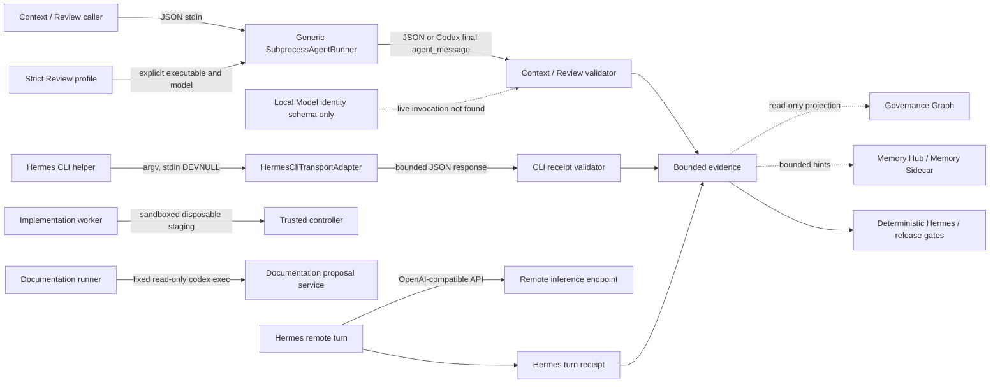

# Runner Topology 與 Transport Matrix

更新日期：2026-09-04
Inspected source：`main@c23294c503b6321797566a21ddbf21ab84f9616f`
文件性質：source-backed reference；不是 runner registry、routing policy、approval 或 release evidence。

本文件描述 NBS Analytics 現有 runner 的角色、identity transport、process/wire boundary、inference location 與 evidence owner。`role` 說明誰負責任務；canonical `transport` 只使用 `runner-identity-v1` 的三個值；process/wire 說明實際 subprocess、stdin、argv 或 API hop。三者不可互相推導。

## Snapshot 與適用範圍

本文件只覆蓋目前 repo 內可定位的 Context／Review subprocess、Strict Review runner profile、Hermes CLI adapter、Hermes Remote API turn、Implementation worker、Documentation runner、Local Model identity schema 與 deterministic Hermes acceptance。source facts、caller wiring、deployment readiness、live verification 分開表示。

固定治理邊界：正式收入口徑是「不含掛賬核銷與TT退款轉團款」，2026-05 frozen baseline 是 `HKD 12,057,968`。本文件不改動 SQLite、正式資料、GMV、業務規則、export schema、workflow state 或任何 release gate。Governance Graph、Memory Hub、Memory Sidecar 與 Agent Operations 只可提供 read-only／non-authoritative context 或 projection。

## Role、transport、process 與 inference

| Layer | 意義 | 例子 | 不能推導的內容 |
|---|---|---|---|
| Role | 任務責任 | Context Agent、Review Agent、Hermes acceptance | 不表示模型或網路位置 |
| Identity transport | canonical runner identity 的傳輸分類 | `local_cli`、`remote_api`、`local_model` | 不表示 caller 是不是 Python subprocess |
| Process/wire | 實際呼叫通道 | JSON stdin、argv、JSONL final message、OpenAI-compatible API | 不自動改變 identity |
| Inference boundary | 模型推論或 deterministic validation 所在位置 | remote endpoint、local model（未驗證）、本地 validator | 本地 launcher 不證明 model weights 在本機 |

## Runner topology

圖中的 dotted edges 是未接線或輔助 observation，不是 control flow。Graph、Memory Hub、Memory Sidecar 不批准、dispatch、啟動 runner、改寫 evidence 或提升 gate status。

## Transport matrix

Row key 是本文件的 reference label，不是新增 runtime enum。

| Row key | Caller / role | Identity transport | Process / wire | Inference / network boundary | Limits / owner | Support status |
|---|---|---|---|---|---|---|
| `context-review-cli` | `scripts/context_agent.py`、`scripts/review_agent.py` 的 Context／Review caller | 由 caller／profile 顯式提供；不從 command basename 推導 | `SubprocessAgentRunner.run` 以 JSON stdin 傳 payload；接受 plain JSON 或 Codex final `agent_message` | caller 是本地 process；model location 取決於被批准 command，未由此 class 證明 offline | 120 秒 default、generic subprocess contract；`AgentRuntime`／caller owner | source 已實作；每次 deployment／model 未由此 row 證明 |
| `strict-review-profile` | Strict Review runner preflight | `RunnerProfile.to_runner_identity` 明確設定 provider、model、profile、environment；mapping 為 `local_cli` | `preflight_runner` 先做 executable/version/cache 檢查，`probe_runner` 再做 capability probe；probe 與 invoke 不是同一步 | CLI 可是 local wrapper 或 remote-backed；inference location 需看 profile/provider | static/cache 與 live probe 各由 `review_runner_profile.py` owner；source anchors：`RunnerProfile.to_runner_identity`、`preflight_runner`、`probe_runner` | source、unit tests；本輪未以此文件重做 live provider turn |
| `hermes-cli` | `run_local_cli_transport` 的明確 Hermes Local CLI helper | `CliInvokeRequest` 要求 `local_cli` | absolute executable + tuple argv、`shell=False`、`stdin=DEVNULL`；解析 JSON 或 event stream 最後 object | local CLI process；是否呼叫 remote model 由 executable/provider 決定 | timeout 60 秒 default、上限 600 秒；stdout/stderr/response default 1,000,000 bytes、上限 10,000,000；adapter owner | adapter、receipt、helper 與 tests 已有；不是通用 CLI switch |
| `hermes-remote-api` | `scripts/hermes_turn_receipt.py` 的 real turn | legacy mapping 為 `remote_api` | 本地 Hermes Python runner 經 OpenAI-compatible SDK 呼叫固定 DeepSeek endpoint；輸出 bounded usage/provenance receipt | inference 在 remote endpoint；本地 launcher 不改變此 hop | timeout、usage、provenance、replay 與 sensitivity 由 turn receipt owner | source/tests；需 real provider credentials 才能做 live turn |
| `local-model` | 目前只在 identity schema／roundtrip 層出現 | `local_model` | 本輪未找到 NBS production invocation adapter 或 caller wiring | 未驗證；不能畫成實際 inference path | 沒有可引用的 deployed capability limit | schema-only；live deployment 未驗證 |
| `implementation-worker` | `scripts/implementation_agent.py` | worker identity 與 task contract 分開核對 | `SandboxedSubprocessAgentRunner` 在 disposable tracked-files staging 執行，trusted controller 才套用 allowlisted files | coding worker 預設無 network；需要 network 的 model transport 必須分離 | sandbox policy、allowed writes、process cleanup 由 `agent_runtime.py` owner | source/tests；不是 Hermes CLI transport |
| `documentation-cli` | Documentation Agent 的 proposal runner | 不將傳入 argv 當 canonical identity；service 驗 evidence／proposal | fixed `codex exec --json --sandbox read-only --ephemeral`，stdin evidence，輸出 draft | wrapper 本身是 local process；model/provider location 需由 configured Codex runtime 判定 | bounded stdout/stderr、timeout、exact draft schema 由 documentation service owner | source/tests；caller model flags 不可假設原樣轉交 |
| `hermes-acceptance` | `hermes_post_change_check.py`、`hermes_gate.py` | release evidence 自己保存 `commitSha`／source fingerprint；不是 model identity | deterministic local inspection、targeted tests、bounded gate report | no model inference required for deterministic acceptance | fresh source-bound reports、read-only indicators、aggregate freshness 由 gate scripts owner | acceptance path；不證明任何 runner capability |

## Identity 與 evidence matrix

| Artifact / layer | Canonical fields or binding | 能證明 | 不能證明 |
|---|---|---|---|
| `runner-identity-v1` | `runnerId`、`transport`、`provider`、`model`、`profile`、`executionEnvironment`、`identityFingerprint` | identity 欄位完整、transport 屬於三個 allowed values、fingerprint 可重算 | 不含 `commitSha`；不證明 executable、network、model availability 或 release PASS |
| `runner-identity-envelope-v1` | identity、`sourceFingerprint`、`artifactKind`、`envelopeFingerprint` | identity artifact 與 source fingerprint 的完整性及 atomic file boundary | 不含獨立 `commitSha`；不證明 runtime 或 provider readiness |
| Review profile／capability | executable、CLI version、cache status、live probe 結果、identity mapping | profile 的 static／live runner capability observation | 不代替 Review verdict、Full pytest、Hermes 或 UI acceptance |
| Hermes CLI receipt | receipt schema、runner identity fingerprint、source／command shape fingerprint、digests、status、timing、response fingerprint | bounded CLI response 與 receipt integrity；`ready` 只代表 adapter response valid | 不證明 probe 已在 invoke 前執行；不代替 Hermes system acceptance 或 aggregate |
| Hermes remote turn receipt | manifest/session/task/source binding、provider/model、usage、provenance、replay、read-only flags | 該 bounded model turn 的 real receipt contract | 不代替 Local CLI receipt、Strict Review、release gate 或 baseline |
| release gate report | `commitSha`、`sourceFingerprint`、gate status、bounded result | 該 gate 在該 source seal 的結果；aggregate 只接受同一 source 的 Full pytest／Hermes／UI reports | 不可由 Graph、Memory hints、舊 handoff 或不同 commit report 補推 PASS |

`identity` 是 runner 描述；`source binding` 是 evidence 描述。文件不新增 `runnerKind`、`transportKind` 或把 `commitSha` 塞入 `RunnerIdentity`。

## 支援、部署與驗證狀態

| 狀態層 | 判讀規則 |
|---|---|
| Source support | 在 repo 找到 class/function 與直接 tests |
| Caller wiring | 找到實際 caller 呼叫該 adapter；helper 存在不等於 public CLI switch 存在 |
| Deployment | 找到 executable／profile／provider configuration；不能從 unit test 推論 |
| Live verification | 有同一次 bounded execution 的 source-bound receipt；不能沿用舊 handoff |
| Release acceptance | Strict Review、Full pytest、Hermes、必要 UI 及 aggregate 各自 fresh 通過 |

本文件只記錄前三至四層的 source-backed 狀態；任何缺口標為「本輪未驗證」或「schema-only」。

## Failure lookup

| Layer | 常見結果 | Read-only 下一步 |
|---|---|---|
| Static profile / cache | `blocked_runtime`、version/cache diagnostic | 讀 profile、CLI version 與 cache schema；不要換 runner 逃避 mismatch |
| Live capability | `blocked_runner_capability` | 讀同一 probe receipt 與 observed model；確認 identity/profile，不把 timeout 當 ready |
| Transport | `blocked_runner_transport`、timeout、non-zero、output cap | 讀 bounded exit code、byte counts、digests；核對 argv／cwd allowlist |
| Parser / response | invalid JSON、invalid event stream、schema mismatch | 依該 parser 的 wire contract 重現 bounded fixture；Codex parser 與 Hermes parser 分開看 |
| Identity / source / receipt | `invalid_evidence`、fingerprint mismatch | 重新計算同一 source／command／receipt binding；不改寫舊 artifact |
| Release freshness | stale、missing、commit/source mismatch | 以目前 immutable HEAD 重跑受影響 gate；aggregate fail closed |

Python exception、adapter status、workflow exit code 與 release gate status 屬於不同 owner；caller 不可自行把它們正規化成 PASS。

## 六個驗收情境

| 情境 | 預期判讀 | Source / test |
|---|---|---|
| 本機 CLI 呼叫 remote model | process 是 local，inference 仍可為 remote；兩層分開記錄 | `agent_runtime.py`、`tests/test_hermes_cli_transport.py` |
| `local_model` roundtrip | schema 接受不等於 production deployment 或 live inference | `runner_identity.py`、`tests/test_runner_identity.py` |
| Codex JSONL 與 Hermes JSONL | 兩個 parser 的 input/output contract 不互換 | `agent_runtime.py`、`hermes_cli_transport.py`、`tests/test_agent_runtime.py` |
| probe ready 後 invoke failed | probe 與 invoke 是兩份不同 observation；transport failure 保留 | `tests/test_hermes_cli_transport.py` |
| response ready 但 receipt/source 不符 | receipt validator 拒絕；ready 不升級為 acceptance | `runner_identity_envelope.py`、`tests/test_hermes_cli_transport_receipt.py` |
| 文件 commit 改變 source | 舊 gate evidence 失效，必須重建同一新 commit/source 的 reports | `scripts/release_gate.py`、`tests/test_release_gate.py` |

## Source/test 索引與更新方式

主要 source：

- [RunnerIdentity](../../backend/agents/runner_identity.py)／[identity envelope](../../backend/agents/runner_identity_envelope.py)
- [generic runner](../../backend/agents/agent_runtime.py)／[Hermes CLI adapter](../../backend/agents/hermes_cli_transport.py)
- [Hermes CLI caller](../../scripts/hermes_live_ab_runner.py)／[remote turn receipt](../../scripts/hermes_turn_receipt.py)
- [Review runner profile](../../backend/agents/review_runner_profile.py)／[Documentation runner](../../backend/agents/documentation_codex_runner.py)
- [Hermes monitoring contract](../../NBS_HERMES_MONITORING.md)／[release gate workflow](../../.github/workflows/release-gates.yml)

主要 tests：

- [runner identity tests](../../tests/test_runner_identity.py)、[envelope tests](../../tests/test_runner_identity_envelope.py)
- [CLI adapter tests](../../tests/test_hermes_cli_transport.py)、[receipt tests](../../tests/test_hermes_cli_transport_receipt.py)
- [live helper tests](../../tests/test_hermes_live_ab_runner.py)、[remote receipt tests](../../tests/test_hermes_turn_receipt.py)
- [generic runner tests](../../tests/test_agent_runtime.py)、[documentation runner tests](../../tests/test_documentation_codex_runner.py)

更新 runner 時，只重查受影響 row、caller、直接 test 與相關 contract。文件開頭的 inspected source、日期與本輪 verification 必須更新；舊 snapshot 不能繼承為 current readiness。文件與 source 不一致時，以 live source 為準並記錄 discrepancy。

## Governance 與 release boundary

本 reference 不提供 runner selection、approval、dispatch、retry、provider installation 或 workflow control。`Governance Graph` 是 canonical artifacts 的 read-only projection；Memory Hub／Memory Sidecar hints 是 bounded optional context；Agent Operations 是 read-only view。它們不能回寫正式業務狀態，也不能將 blocked／stale／missing evidence 提升為 ready。

Full pytest、Hermes、UI acceptance、Strict Review 與 release aggregate 仍按既有 contract 分開執行。任何新實作都必須以新的 commit SHA 與 source fingerprint 取得 fresh evidence。
