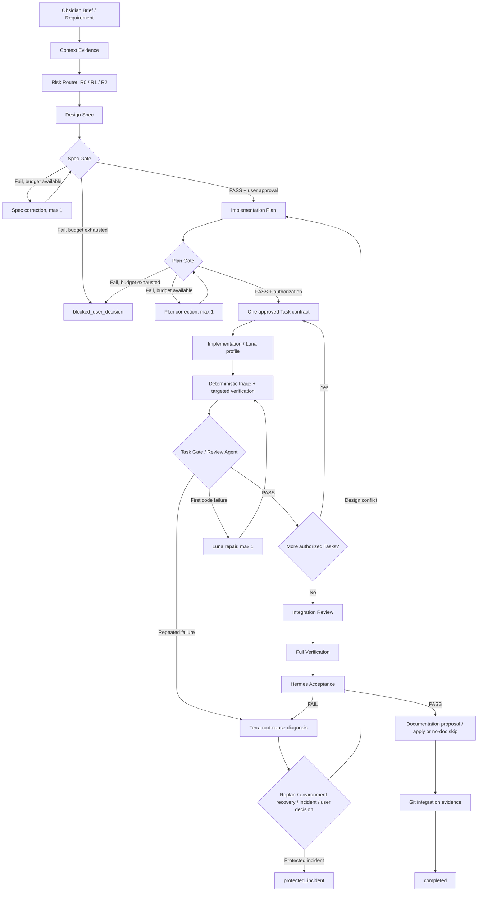

# NBS Governance Graph Design

狀態：approved for implementation planning
日期：2026-07-22
範圍：以 canonical workflow artifacts 為真相來源，建立開發流程 Governance Graph contract、風險路由、Gate、證據新鮮度與只讀 snapshot

## 1. 目的

將 NBS Analytics 現有的線性 Agent SOP 升級為「Governance Graph」。Graph 定義標準節點、允許的轉移、風險路由、修正預算、必要證據與完成條件，但不自行批准、分派、修改程式、操作正式資料或推動下一個 Task。

本設計保留 Codex 與使用者的路由決定權，同時讓系統可機器檢查：目前完成了哪些 Gate、證據是否仍有效、哪些節點被阻擋、還可修正幾次，以及下一步有哪些合法選項。

Governance Graph 的核心原則是：

- 現有 canonical artifacts 繼續是唯一真相來源。
- `governance-graph.json` 只是由 canonical artifacts 生成的只讀 snapshot。
- Graph 不建立第二套 workflow database 或獨立可變狀態。
- Graph 不放寬 frozen baseline、正式口徑、Agent 權限、人工授權、Review、完整驗證或 Hermes gate。
- 第一階段只建立 contract core，不建立自動執行狀態機。

## 2. 已確認的產品選擇

- 採用 Governance Graph，不採用純文件流程圖或全自動 executable state machine。
- Graph 是治理規範與機器可讀 contract；Codex 和使用者保留實際路由權。
- 風險分為 `R0`、`R1`、`R2` 三級；不確定時向較高風險升級。
- `R2` protected surface 不交給目前的 Implementation Agent，必須由 Codex 在明確授權下控制實作。
- Spec、Plan 與 Luna repair 各有一次修正預算；超出後停止為 `blocked_user_decision`。
- Terra 是重複失敗後的診斷 profile，只產生根因與路由建議，不直接修改程式。
- 預設授權模式是 `per_task`；只有使用者明確批准指定 Task 批次時才使用 `approved_batch`。
- Agent Operations 未來只讀顯示 Graph snapshot，不成為批准、分派、修復、prune 或寫入入口。
- 通知只出現在需要授權、blocked、protected incident 與 completed，不為每個內部 transition 發通知。

## 3. 明確非目標

第一階段不建立：

- 自動選擇或購買 Luna、Terra 或其他外部模型。
- 自動批准 Spec、Plan、Task、R2 protected change、Documentation target 或 Git integration。
- 自動推動下一個 Task、commit、merge、push、rollback、baseline promotion 或服務管理。
- 新的向量資料庫、workflow database、daemon、queue 或 background scheduler。
- 第二套 Context、Review、Hermes 或 Documentation Agent。
- Streamlit 寫入控制、FastAPI dispatch endpoint 或 Vue Agent UI。
- 對正式 SQLite、upload、rollback、營收口徑、baseline、業務規則或 export 計算的改動。

Phase B 的 Agent Operations 顯示與 Phase C telemetry 不屬於第一個 implementation plan。

## 4. 全景流程



Graph 只描述合法路由及證據要求。任何 transition 是否實際發生，仍由 canonical artifact 證明。

## 5. 風險路由

### 5.1 R0 Lightweight

適用於：

- read-only explanation；
- 單行 typo、拼字、格式；
- 不改行為的獨立文件；
- 已有合法 fingerprint 的 cache reuse；
- 不涉及 code、runtime、正式資料或治理語意的微小變更。

R0 可使用精簡 contract 與 targeted check。若實際 diff 觸及 code、schema、權限或正式治理文字，必須重新分類為 R1 或 R2。

`valid_fingerprint_cache_hit` 只代表可重用對應的已驗證 evidence，不代表可跳過 Review、full verification 或 Hermes。任何 `.py`、`.vue`、`.js`、`.mjs`、`.sql`、`.json` 的行為性變更至少分類為 R1；R0 不得用來規避 code-change gate。

### 5.2 R1 Standard Engineering

適用於：

- Streamlit / Vue UI；
- read-only API；
- 效能、cache、read model；
- Agent tooling、orchestration 與 telemetry；
- 不改正式資料口徑的有限重構；
- 一般 bugfix 與測試補強。

R1 走完整 Spec Gate、Plan Gate、單一 Task contract、Implementation Agent、targeted verification 與 Review Agent 路徑。

### 5.3 R2 Protected Surface

只要任務可能改動以下任一範圍，分類為 R2：

- upload write path；
- 正式 SQLite write、migration、upsert 或明確 DB path；
- frozen baseline、monthly gate、baseline promotion；
- rollback、quarantine、stability history；
- revenue scope、business rules、branch / salesperson reassignment；
- export schema 或正式報表計算；
- 正式 production data；
- secrets、持久權限、安全或不可逆治理決策。

R2 必須取得明確使用者授權，由 Codex 控制實作並擴大驗證。現有 Implementation Agent denied surfaces 維持不變，不得因 Graph 而放寬。

### 5.4 Fail-Closed 分類

- 任務同時命中多級時使用最高級別。
- 證據不足、DB path 不明、口徑語意不清或 changed surface 無法歸屬時，至少升級至 R2 並停止等待決策。
- Risk Router 優先使用 deterministic path / symbol / contract 規則；模型只能補充理由，不得降低 deterministic classification。

## 6. 五層節點架構

### 6.1 Intake

節點：Requirement / Obsidian Brief、Context Evidence、Risk Router。

目的：固定需求 identity、guardrails、受影響 surface、相關檔案、風險級別與建議驗證。Context Agent 繼續只做 bounded read-only evidence summarization。

### 6.2 Design

節點：Design Spec、Spec Gate、Spec correction。

Design Spec 必須定義目的、範圍、非目標、架構、資料流、權限、錯誤處理、驗收方式與正式 guardrails。Spec correction 最多一次；第二次仍未通過則停止為 `blocked_user_decision`。

### 6.3 Planning

節點：Implementation Plan、Plan Gate、Task contracts。

Plan 必須把工作拆成單一責任 Task，列明 allowlisted paths、依賴、TDD / verification、完成條件、停止條件與 owner。Plan correction 最多一次。

### 6.4 Task Execution

節點：一個已批准 Task contract、Implementation/Luna、deterministic triage、targeted verification、Review Agent、Luna repair、Terra diagnosis。

每次 Implementation Agent run 仍只執行一個已批准 Task，不得決定下一個 Task、commit、merge、服務管理或 R2 protected change。Task Gate PASS 只代表可進下一個已授權 Task，不代表整體完成。

### 6.5 Final Governance

節點：Integration Review、Full Verification、Hermes、Documentation、Git integration。

Review PASS 不取代 full verification 或 Hermes。Documentation 只有在 Review、full verification 與 Hermes PASS 後才可 dispatch；最後由 approved Controller 依 target authorization 套用。Git integration 仍由 Codex 或使用者決定。

Integration Review 是 Codex 對多個已通過 Task 的整體 diff、Task contract coverage、cross-task dependency 與合併後行為所做的整合檢查。它不重做 Review Agent 的逐 Task findings-first review，也不取代 Hermes 對 runtime、SQLite、baseline、服務與整體 acceptance 的驗收。

## 7. Gate Ownership

| Gate | Deterministic checks | 語意／人工權責 | PASS 的含義 |
|---|---|---|---|
| Spec Gate | 必要章節、風險面、guardrails、acceptance、rollback、exclusions | Codex 處理語意；使用者批准 written spec | 可進入 implementation planning |
| Plan Gate | Task 邊界、allowlisted paths、tests、dependencies、owner、stop conditions | Codex 修正；使用者批准 execution mode | 可建立指定 Task contracts |
| Task Gate | targeted verification evidence、diff identity、contract coverage | Review Agent findings-first review | 可進入下一個已授權 Task或 Final Governance |
| Final Gate | integration evidence、full verification、Hermes、documentation、Git evidence | Codex 整合；Hermes 負責 runtime / DB / baseline | 全部必要節點滿足後才可 completed |

Spec Gate 與 Plan Gate 不建立新的 LLM Agent。第一階段以 deterministic validator 加 Codex / 使用者決策實現，避免與 Review Agent 重複。

## 8. 授權模式

### 8.1 per_task

預設模式。每個 Task 完成 targeted verification 與 Review 後停止，等待使用者明確批准下一個 Task。

### 8.2 approved_batch

只有使用者明確列出可連續執行的 Task IDs 或範圍時才能啟用。每個 Task 仍必須單獨建立 contract、實作、驗證與 Review；失敗、scope expansion、R2 surface 或設計衝突會立即停止 batch。

授權不保存 runner command、secret 或隱含模型選擇。沒有明確授權時不得從 `per_task` 自動升級成 `approved_batch`。

## 9. 修正、診斷與失敗路由

### 9.1 預算

| Loop | 上限 | 耗盡後狀態 |
|---|---:|---|
| Spec correction | 1 | `blocked_user_decision` |
| Plan correction | 1 | `blocked_user_decision` |
| Luna repair | 每個 Task 1 次 | `diagnosis_required` |

修正預算以 run ID、Task ID、contract fingerprint 與 failure fingerprint 綁定；不得藉改名或重建同一 Task 規避上限。

### 9.2 Deterministic Triage

局部驗證失敗後先分類：

- 環境／服務／port／dependency 狀態問題：走 environment recovery，不消耗 Luna code repair 預算。
- 程式或測試問題：第一次可交 Luna 做一次受限修復。
- stale artifact / fingerprint mismatch：重建 evidence，不修改程式。
- 設計或 Task contract 衝突：返回 Plan Gate，不繼續猜測。
- baseline drift、正式口徑衝突、unsafe DB path 或 protected invariant failure：立即進入 `protected_incident`。

### 9.3 Luna

Luna 是 bounded implementation profile，不是新治理角色。它只能修改一個 approved Task contract 的 allowlisted paths，修復後重跑相同 targeted verification。不得自行擴大 scope、變更 Gate、決定下一 Task 或修改 R2 denied surfaces。

### 9.4 Terra

Terra 在重複失敗或 Hermes failure 後只產生 root-cause report，輸出：

- failure classification；
- evidence refs；
- root-cause hypothesis 與 confidence；
- 是否屬 design conflict；
- 建議路由：replan、environment recovery、protected incident 或 user decision；
- 禁止的猜測性修復。

Terra 不直接修改程式、不放寬測試、不重寫 baseline、不取代 Review Agent 或 Hermes。

## 10. Canonical Artifacts 與 Snapshot

### 10.1 真相來源

Graph Builder 只讀既有或新增的 allowlisted canonical artifacts：

- Brief / requirement identity；
- Context bundle / summary；
- `risk-classification.json`；
- design spec 與 `design-spec-gate.json`；
- implementation plan 與 `plan-gate.json`；
- Task contracts；
- `implementation.json`；
- `targeted-verification.json`；
- `review.json`；
- `full-verification.json`；
- `hermes.json`；
- documentation proposal / preview / application；
- bounded Git integration evidence。

Artifact 本身的 schema、fingerprint 與 status 仍是正式依據。Graph snapshot 不可用自己的狀態推翻 canonical artifact。

### 10.2 Snapshot 路徑

```text
.nbs_agent_runtime/runs/<run-id>/governance-graph.json
```

Snapshot 是可重建 read model，不作為正式輸入。刪除或遺失 snapshot 不影響 canonical workflow；重新 build 即可恢復。

此邊界是強制 invariant：`agent_workflow.py`、Implementation / Documentation Controller、Hermes 與 Agent Operations 均不得使用 snapshot 推進、回退、批准、分派、修復或改寫正式 workflow 狀態。它們只能把 snapshot 當作只讀治理顯示或診斷摘要。

### 10.3 Snapshot Contract

第一階段 contract：

```json
{
  "schemaVersion": "nbs-governance-graph-v1",
  "runId": "run-id",
  "generatedAt": "ISO-8601",
  "graphFingerprint": "sha256",
  "risk": {
    "level": "R1",
    "surfaces": [],
    "evidenceRefs": []
  },
  "authorizationMode": "per_task",
  "overallStatus": "awaiting_authorization",
  "nodes": [
    {
      "nodeId": "spec_gate",
      "nodeType": "gate",
      "status": "passed",
      "attempt": 1,
      "maxAttempts": 2,
      "evidenceRefs": [],
      "fingerprint": "sha256",
      "reasonCode": null
    }
  ],
  "allowedNextNodes": [],
  "blockers": [],
  "freshness": {},
  "diagnostics": []
}
```

Node status 只允許：

- `not_started`
- `ready`
- `passed`
- `failed`
- `blocked`
- `skipped`

Graph 不使用 `running` 作為推導狀態；執行中狀態仍由 canonical workflow `status.json` 表達。Snapshot 可在 `overallStatus` 映射現行 workflow 狀態，但不得虛構 node evidence。

### 10.4 Evidence Refs

每個 evidence ref 只包含 repo / run-relative path identity、schema version、SHA-256、bounded status 與產生時間。不得包含：

- 原始 Excel rows 或 SQLite records；
- 完整 logs、stdout、stderr 或 patch；
- secrets、environment、runner command 或 prompt；
- Obsidian vault 絕對路徑；
- 內部推理內容。

## 11. Transition Policy

Graph 使用 allowlist transition table。任何未列出的 transition 都是 blocked：

| From | To | 必要條件 |
|---|---|---|
| context evidence | risk classification | context fingerprint valid |
| risk classification | design spec | risk evidence complete |
| design spec | spec gate | spec fingerprint valid |
| spec gate | spec correction | failed 且 correction budget available |
| spec gate | implementation plan | PASS 且 user spec approval |
| implementation plan | plan gate | plan fingerprint valid |
| plan gate | plan correction | failed 且 correction budget available |
| plan gate | Task contract | PASS 且 execution authorization valid |
| Task contract | implementation | contract、Git 與 allowlist fresh |
| implementation | targeted verification | implementation evidence valid |
| targeted verification | review | targeted evidence matches diff fingerprint |
| review | next Task | PASS 且下一 Task 已授權 |
| review | integration review | PASS 且無剩餘必要 Task |
| repeated failure | Terra diagnosis | Luna budget exhausted或 Hermes failure |
| integration review | full verification | integration review PASS |
| full verification | Hermes | full verification PASS |
| Hermes | documentation | Hermes PASS |
| documentation | Git integration | applied 或 deterministic no-doc skip |
| Git integration | completed | configured integration outcome recorded |

`skipped` 必須有 deterministic policy reason code；不得以人工自由文字跳過必要 Gate。

## 12. Freshness 與下游失效

Graph fingerprint 至少涵蓋：

- graph schema / policy version；
- run ID；
- requirement / Brief fingerprint；
- risk classification fingerprint；
- design spec 與 plan fingerprint；
- Task contract identities；
- Git base / head；
- tracked dirty-file fingerprint；
- referenced canonical artifact fingerprints。

失效規則：

| 變更 | 必須失效的下游 evidence |
|---|---|
| Requirement / Brief 改變 | risk、spec、plan、所有 Task 與 final gates |
| Risk classification 升級 | spec、plan、所有 Task 與 final gates |
| Design Spec 改變 | Spec Gate 後的 plan、Task、Review、full verification、Hermes、docs、Git evidence |
| Plan / Task contract 改變 | implementation、targeted verification、Review 與全部 final gates |
| 實際 diff 或 Git HEAD 改變 | targeted verification、Review、full verification、Hermes、docs 與 Git evidence |
| Verification command / result 改變 | consuming Review / final gate |
| Hermes evidence 改變 | documentation 與 completion evidence |

失效代表 snapshot 將 node 降回 `not_started`、`ready` 或 `blocked`，並加入 bounded diagnostic；不得刪除 canonical historical artifact。

## 13. Completion Semantics

Task Gate PASS 不是完整完成。Terminal 狀態定義：

- `awaiting_authorization`：合法下一步需要使用者批准。
- `blocked_user_decision`：修正預算耗盡或語意衝突。
- `diagnosis_required`：重複失敗，等待 Terra report。
- `protected_incident`：baseline、正式口徑、DB path 或 protected invariant 風險。
- `blocked_missing_runner`：需要 Documentation Agent，但 approved runner 缺失；不得由主 Codex LLM fallback。
- `awaiting_documentation`：approved runner 已存在，正等待 proposal、target authorization 或 Controller application。
- `ready_for_integration`：Hermes 與文件完成，等待 Git outcome。
- `completed`：全部必要節點及配置的 Git outcome 已有合法 evidence。

Documentation 只接受：

- approved target application 已成功；或
- deterministic classifier 產生合法 `no_documentation_needed`。

Git integration evidence 可記錄：

- `committed`
- `merged`
- `kept_branch_by_user`

Graph 不執行 Git。若使用者選擇保留 branch，必須有明確決策 artifact，不能由缺少 merge evidence推斷。

## 14. 通知

第一階段可沿用現有 macOS notification adapter，但 Graph 只在以下狀態提出通知事件：

- `awaiting_authorization`
- `blocked_user_decision` / `diagnosis_required` / `blocked_missing_runner`
- `protected_incident`
- `completed`

通知失敗只記錄 bounded warning，不改變 Graph 或 canonical workflow 狀態。Agent Operations 不自動刷新或因通知寫入任何狀態。

## 15. Phase A 實作範圍

第一個 implementation plan 只包括：

1. `nbs-governance-graph-v1` schema models 與 strict validation。
2. R0/R1/R2 deterministic risk policy。
3. Spec Gate、Plan Gate 與 transition policy models。
4. Retry budget、reason code 與 fail-closed transition validation。
5. Freshness fingerprint 與 downstream invalidation rules。
6. 由 allowlisted canonical artifacts 生成 snapshot 的 projection-only builder。
7. CLI：`build` 只能原子寫入可重建的 `governance-graph.json`；`validate`、`status` 必須零寫入。三者都不得 approve、dispatch、repair 或 apply。
8. 與現有 Workflow Store、retention、Hermes sidecar 與 Agent Operations contract 的 regression tests。
9. 更新 Agent architecture / dispatch documentation，但不新增 application runtime UI。

Phase A 不要求 Luna 或 Terra runner 真正可調用。Contract 先定義它們的受限輸出、預算與路由，模型 runner 留在後續獨立 Brief。

## 16. Phase B 與 Phase C

### Phase B：Agent Operations Read-Only View

- 顯示五層 Graph、risk level、node status、blockers、evidence refs、retry budget 與 allowed next nodes。
- 只有手動刷新；不提供批准、分派、停止、重跑、修復、prune 或刪除按鈕。
- 不直接掃描 artifacts，由共用 Read Model Service 消費 validated snapshot。

### Phase C：Telemetry

- stage / gate cycle time；
- Spec、Plan、Task Gate failure count；
- Luna repair 與 Terra diagnosis count；
- stale evidence frequency；
- protected incident count；
- supplied 時才顯示 Token usage，缺失時保持 `null`。

Telemetry 不啟用自動路由，也不估算 Codex Plus 使用額度。

## 17. 安全與 Fail-Closed 規則

- Project root、runtime root、run directory、artifact 與 snapshot 必須通過既有 path / symlink safety。
- Builder 只讀 allowlisted relative artifact names；拒絕未知 schema、oversize file、absolute target、path traversal、symlink 與 non-regular file。
- 單一損壞 artifact 使相關 node blocked；不得寬鬆解析後宣稱 PASS。
- Snapshot Builder 唯一允許的寫入是原子建立或替換同一 run 的可重建 `governance-graph.json`；不得修改 canonical artifacts、SQLite、baseline、Git、Obsidian 或服務。
- Graph 不保存 runner command、完整 prompt、內部推理、secrets、完整 patch、原始資料 rows 或完整 logs。
- protected incident 不得以 Luna repair、Terra suggestion、manual `skipped` 或 notification failure繞過。
- 正式口徑固定為「不含掛賬核銷與TT退款轉團款」。
- 2026-05 baseline 固定為 `HKD 12,057,968`。

## 18. 錯誤處理

- Runtime 或 run 不存在：回傳 blocked snapshot 或明確 `run_not_found`，不得建立空 completed graph。
- Optional artifact 尚未產生：node 為 `not_started`，不是 failure。
- Required artifact 缺失或 schema 錯誤：node 為 `blocked`，加入 bounded diagnostic。
- Snapshot 過期：重新 build；舊 snapshot 不作為 transition evidence。
- Risk surface 無法分類：升級 R2 並 `awaiting_authorization`。
- Correction budget 耗盡：`blocked_user_decision`。
- Terra report 缺失或 invalid：保持 `diagnosis_required`。
- Full verification 或 Hermes FAIL：不得 dispatch Documentation，也不得 completed。
- Documentation runner 已存在但 proposal、target approval 或 apply 尚未完成：狀態為 `awaiting_documentation`，不得由主 Codex LLM 靜默代寫。
- Documentation runner 缺失：固定為 `blocked_missing_runner`；只有 runner 已存在而等待 proposal、target approval 或 apply 時才使用 `awaiting_documentation`。
- Git evidence 缺失：狀態為 `ready_for_integration`，不是 completed。

## 19. 測試與驗收

### 19.1 Schema 與 Policy Tests

- 合法與非法 node status、overall status、risk level、authorization mode。
- 缺 field、unknown field、unknown schema、invalid SHA-256、duplicate node ID。
- transition allowlist 與 forbidden transition。
- deterministic skip reason code。

### 19.2 Risk Router Tests

- R0 typo / read-only / format-only。
- R1 UI、read API、cache、agent tooling。
- R2 upload、SQLite、baseline、rollback、revenue、business rules、export schema。
- 多 surface 取最高風險；unknown / ambiguous fail closed 至 R2。
- Risk Router 不可降低 Implementation Agent denied surface。

### 19.3 Retry 與 Failure Tests

- Spec correction 一次後 blocked。
- Plan correction 一次後 blocked。
- Luna repair 一次後轉 diagnosis_required。
- environment recovery 不消耗 code repair budget。
- design conflict 返回 Plan Gate。
- protected invariant failure 立即 protected incident。

### 19.4 Freshness Tests

- Brief、risk、spec、plan、Task contract、Git head / diff 改變時正確失效下游。
- 未改變 fingerprint 時 idempotent rebuild。
- stale Review、full verification、Hermes、documentation evidence 不可宣稱 PASS。
- historical canonical artifacts 不被刪除或改寫。

### 19.5 Read-Only 與安全測試

- symlink root / run / artifact / snapshot target。
- path traversal、absolute path、unknown artifact、oversize artifact、non-regular file。
- snapshot 不包含 secrets、absolute vault path、runner command、raw rows、full logs 或 prompts。
- build / validate / status 不修改 tracked files、正式 SQLite、canonical run artifacts 或 Git。

### 19.6 Integration Tests

- 模擬 R1 完整 run：Brief 至 completed。
- 模擬 R2 run：在明確授權前停止。
- 模擬 Task failure -> Luna repair -> Terra diagnosis。
- 模擬 full verification / Hermes FAIL，確認 Documentation 不會 dispatch。
- 模擬 Documentation applied、no-doc skip、blocked runner。
- 模擬 committed、merged、kept branch 三種 Git outcome。
- 現有 Context、Implementation、Review、Workflow Store、retention、Agent Operations、Hermes 與 Documentation regression pack。

### 19.7 正式驗收

1. Graph focused tests。
2. Agent workflow / implementation / review / documentation regression tests。
3. `git diff --check`。
4. Full pytest。
5. `scripts/system_manager.py acceptance`。
6. `scripts/hermes_post_change_check.py --skip-monitor --json`。
7. 正式 SQLite SHA-256 前後一致。
8. 2026-05 baseline 保持 `HKD 12,057,968`。
9. 正式口徑保持「不含掛賬核銷與TT退款轉團款」。

## 20. 完成定義

- Governance Graph 的 risk、node、Gate、transition、retry、freshness 與 completion contract 無歧義。
- Canonical artifacts 保持唯一真相來源，Graph snapshot 可完全重建。
- R2 protected surface 不會路由至目前的 Implementation Agent。
- Spec、Plan、Task 與 Final Gate 權責不與 Context、Review、Hermes、Documentation 重複。
- repeated failure 不會無限消耗 Token；Terra 只診斷，Luna 只做一次受限修復。
- Graph snapshot 只讀、bounded、無敏感資料，且不新增 application runtime 寫入入口。
- Phase A scope 可由一份 implementation plan 拆成小型、可測試 Tasks。
- frozen baseline、正式口徑、SQLite、Git、Obsidian 與服務治理邊界保持不變。
