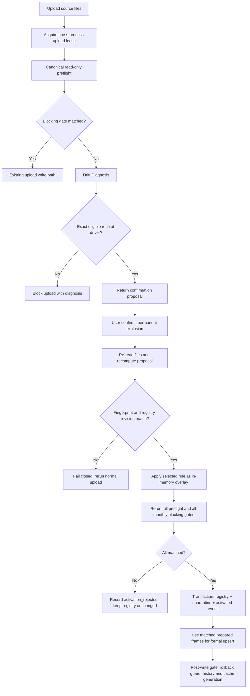
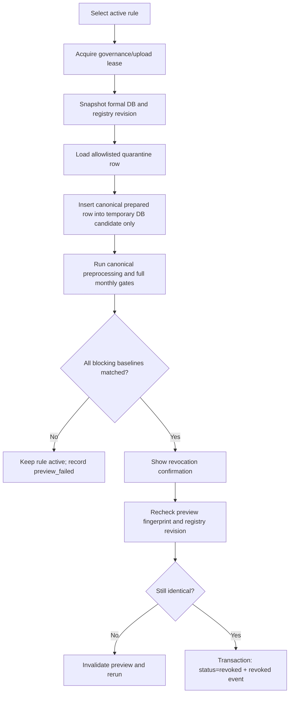

# Persistent Receipt Exclusion Registry Design

狀態：待使用者審閱  
日期：2026-07-23  
適用系統：NBS Analytics Streamlit / FastAPI upload pipeline

## 1. 背景

最新上傳預演正確偵測到 `2026-06` 正式營收由 `HKD 9,083,241.29`
下降至 `HKD 9,081,971.29`。Drift Diagnosis 已定位：

- 來源單據號：`31NZY6629115617`
- 收款單號：`SK2606005393`
- 收款方式：`TT 退款轉團款`
- 受影響正式收入：`HKD -1,270`

目前使用者若要讓上傳通過，需要手動修改主表 Excel。這個做法容易漏做、
缺少 audit，重新上傳全量快照時也會再次遇到相同問題。

本設計建立「SQLite Registry + Quarantine Evidence」治理能力。使用者只需在
Drift Diagnosis 中確認一次，往後相同的精確收款單會在 ingest 前自動排除；
規則可以經預演後安全撤銷。

## 2. 目標

1. Drift Diagnosis 找到可精確歸因的排除類收款單時，讓使用者在 Streamlit
   直接確認永久排除，不必修改 Excel。
2. 已啟用規則在 Streamlit 與 FastAPI 兩個 upload 入口採用相同語義。
3. 每次自動排除都留下可追溯的 registry、quarantine evidence 與 append-only event。
4. 提供撤銷預演；只有全部 blocking baseline matched 才允許撤銷。
5. 保持 single-writer、明確 DB path、rollback、monthly history 與 cache generation
   契約一致。

## 3. 不變量

- 正式口徑仍為：`不含掛賬核銷與TT退款轉團款`。
- `2026-05` frozen baseline 仍為 `HKD 12,057,968`。
- `2026-06` baseline 仍為 `HKD 9,083,241`。
- 不修改 baseline registry、金額、人數、交易數量、分社歸屬或報表計算。
- 不在 Vue、Streamlit table、export rounding 或 dashboard analysis layer 隱藏 drift。
- 不允許以人工確認繞過 preflight、monthly blocking gate、rollback 或 Hermes。
- 排除只使用完整正規化後的收款單號與來源單據號，不使用 prefix、contains、
  regex 或模糊匹配。
- 正式營收資料表不保存被永久排除的收款行；quarantine 只保存該行的治理證據，
  不保存整份 workbook。

本功能位於既有 Frozen Baseline upload guard 之前。原有「新排除類收款行不得
回溯拖動歷史正式收入」保護、正式口徑排除與 rollback 全部保留；Registry
只處理經 Drift Diagnosis 與人工確認的精確 identity，不取代既有通用 guard。

## 4. 採用方案

採用三張獨立治理表：

1. `receipt_exclusion_registry`：規則的目前狀態。
2. `receipt_exclusion_quarantine`：被確認排除的原始行證據。
3. `receipt_exclusion_events`：proposal、activation、auto-apply、collision、
   revocation preview 與 revoke 的 append-only audit。

三張表放在明確指定的正式 SQLite path，但不屬於 `tour_data` 或 `others_data`
正式事實表。所有治理寫入必須在既有 cross-process upload lease 內執行。

不採用 `rules_config.json`，因為它沒有 transaction、唯一性、併發與 append-only
history 保證；也不建立第二個可自行改口徑的規則引擎。

## 5. 精確匹配契約

### 5.1 正規化

以下 identity 欄位在比較前必須使用共同 deterministic normalizer：

- `receipt_no`：收款單號，去除前後與全形空白並轉大寫。
- `source_order_no`：來源單據號，去除前後與全形空白並轉大寫。
- `exclusion_kind`：
  - `receipt_type:掛賬核銷`
  - `payment_method:TT 退款轉團款`

規則只有在 `receipt_no + source_order_no + exclusion_kind` 全部完全一致時命中。

### 5.2 允許的變化

同一規則再次出現時，金額、檔名或上傳日期可以不同；系統仍自動排除，但必須把
本次觀察值寫入 event。這可處理上游全量快照重新輸出時的格式或金額修正。

### 5.3 Collision

以下情況不得靜默自動排除：

- 相同收款單號出現在不同來源單據號。
- 相同收款單號已不再是 `掛賬核銷` 或 `TT 退款轉團款`。
- 同一上傳批次出現互相衝突的 identity。

系統回傳 `receipt_exclusion_collision` 並停止 upload。使用者必須先查看差異，
不得沿用舊規則把修正版正常收款隱藏。

## 6. 資料模型

### 6.1 `receipt_exclusion_registry`

| 欄位 | 語義 |
|---|---|
| `id` | SQLite integer primary key |
| `receipt_no_norm` | 正規化收款單號 |
| `source_order_no_norm` | 正規化來源單據號 |
| `exclusion_kind` | 允許的排除類型 |
| `status` | `active` 或 `revoked` |
| `reason` | 人類可讀確認原因 |
| `evidence_hash` | canonical quarantine evidence SHA-256 |
| `proposal_fingerprint` | 確認時重新計算的 proposal fingerprint |
| `created_operation_id` | 啟用規則的 upload operation |
| `created_by` | 本地入口 identity，例如 `streamlit-local` |
| `created_at` | ISO-8601 timezone-aware timestamp |
| `revoked_operation_id` | 成功撤銷的治理 operation |
| `revoked_by` | 撤銷操作者 |
| `revoked_at` | 撤銷時間 |

`receipt_no_norm + source_order_no_norm + exclusion_kind` 必須有唯一約束。
重複確認相同 active 規則為 idempotent success，不新增第二條規則。

### 6.2 `receipt_exclusion_quarantine`

| 欄位 | 語義 |
|---|---|
| `id` | SQLite integer primary key |
| `registry_id` | 對應 registry rule |
| `operation_id` | 首次確認 operation |
| `source_file_name` | basename，不保存絕對路徑 |
| `source_file_sha256` | 原始檔案 fingerprint |
| `raw_payload_json` | allowlisted 主表 raw row payload |
| `raw_row_hash` | raw payload SHA-256 |
| `prepared_payload_json` | 同次 matched overlay preflight 的 allowlisted canonical prepared row |
| `prepared_row_hash` | prepared payload SHA-256 |
| `observed_amount` | 當次原幣金額 |
| `observed_at` | 保存時間 |

`raw_payload_json` 只允許 identity、收款語義、金額、日期與來源欄位。
`prepared_payload_json` 保存同一次 preflight 已完成 Entity Resolution 後、足以在
temporary DB 重播的正式 schema 欄位；欄位集合必須等於既有 facts table schema
allowlist。不得保存整份 Excel、密碼、絕對路徑或任意額外欄位。

撤銷預演使用 `prepared_payload_json`，避免只靠 raw row 重新推斷已不存在的副表
上下文；`raw_payload_json` 只作來源證據與 collision 診斷。

### 6.3 `receipt_exclusion_events`

| 欄位 | 語義 |
|---|---|
| `id` | SQLite integer primary key |
| `registry_id` | 可為空；proposal 尚未啟用時使用 fingerprint 關聯 |
| `operation_id` | upload 或 governance operation |
| `event_type` | 受控 enum |
| `proposal_fingerprint` | proposal identity |
| `payload_json` | bounded audit 摘要 |
| `created_at` | 事件時間 |

允許的 `event_type`：

- `activated`
- `activation_rejected`
- `auto_applied`
- `collision_blocked`
- `revocation_preview_passed`
- `revocation_preview_failed`
- `revoked`

events 不提供 update/delete 路徑。Registry 的狀態變更與對應 event 必須在同一
SQLite transaction 完成。

## 7. Proposal Contract

一般 preflight 保持 read-only。只有 Drift Diagnosis 符合以下條件才產生
`receipt-exclusion-proposal-v1`：

1. blocking gate 為 drift。
2. `topDrivers` 有完整來源單據號與收款單號。
3. driver 是新增的 `掛賬核銷` 或 `TT 退款轉團款` 收款行。
4. driver 對選定 monthly gate 的差額有 deterministic row-level evidence。
5. 沒有 identity collision。

Proposal 至少包含：

```json
{
  "schemaVersion": "receipt-exclusion-proposal-v1",
  "status": "confirmation_required",
  "operationId": "upload-operation-id",
  "proposalFingerprint": "sha256",
  "sourceBatchFingerprint": "sha256",
  "diagnosedCheckKey": "monthlyRevenue:2026-06",
  "expectedTotal": 9083241.29,
  "actualTotal": 9081971.29,
  "deltaAmount": -1270.0,
  "candidates": [
    {
      "sourceOrderNo": "31NZY6629115617",
      "receiptNo": "SK2606005393",
      "exclusionKind": "payment_method:TT 退款轉團款",
      "observedAmount": 1630.0,
      "affectedRevenue": -1270.0,
      "rowHash": "sha256"
    }
  ]
}
```

Fingerprint 必須涵蓋 source batch、selected gate、candidate identities、row hashes、
正式 DB path identity 及 registry revision。不得信任 UI 回傳的 row payload。

## 8. 啟用流程



### 8.1 重要順序

排除 overlay 必須作用在營收主表 raw frame，並發生於 `process_raw_files`、
Entity Resolution、`build_revenue_scope_frames` 及 dashboard facts 之前。

不能在 preflight 結束後刪除 prepared rows，因為排除類收款行可能已令同一來源
單據號的其他正式收入被整單排除。

### 8.2 確認時重新驗證

Streamlit 或 API 傳回的 proposal 只是一個請求，不能直接啟用。Controller 必須：

1. 重新讀取目前上傳檔案。
2. 重新計算 source batch fingerprint、driver 與 proposal fingerprint。
3. 確認 registry revision 未變。
4. 在同一 upload lease 內重新跑完整 preflight。

若 file uploader 已失效或 fingerprint 改變，顯示「來源檔案已變更，請重新上傳」，
不使用先前 proposal。

### 8.3 多個 driver

第一版允許 proposal 顯示多個精確候選，但每個候選預設未勾選。系統只對使用者
明確選取的候選建立 overlay；選取結果仍須共同通過完整 monthly gate。不得提供
「全部同類型永久排除」按鈕。

## 9. 日後自動排除流程

每次 preflight 開始時，以明確 `live_db_path` 讀取一次 active registry snapshot，
取得 `registryRevision`：

1. 掃描營收主表 raw rows。
2. 精確匹配 active registry。
3. 先做 collision check。
4. collision 為零時，在 ingest 前移除命中行。
5. Preflight report 產生 bounded、尚未寫入的 auto-apply audit payload。
6. Preflight report 顯示命中規則、排除行數、金額、registry revision 與 rule IDs。
7. 繼續執行完整 monthly gate；即使命中永久規則，baseline drift 仍然阻擋。
8. 只有 matched operation 準備進入正式 upsert 時，Orchestrator 才把 audit payload
   寫成 `auto_applied` event；一般 preflight 本身保持 read-only。

同一批重試必須 idempotent：events 以
`operation_id + registry_id + row_hash + event_type` 唯一，避免 Streamlit rerun
重複寫入 audit。

## 10. 撤銷流程



撤銷分成兩次明確動作：

1. `預演撤銷`
2. `確認撤銷`

Preview fingerprint 必須涵蓋 rule identity、raw/prepared row hashes、formal DB
snapshot identity、registry revision 與所有 blocking gate 結果。任何一項改變
都使確認失效。

若 quarantine evidence 不完整、row hash 不符、baseline drift、DB path 不明確或
另一 upload 正在執行，撤銷停止並保持 rule active。

第一版不提供 force revoke。若上游已提供修正版正常收款行，系統會因 identity
collision 停止；後續可在另一個經批准的 Brief 設計「以修正版檔案預演撤銷」，
不得在本功能內猜測修正語義。

## 11. UI 與 API

### 11.1 Streamlit

Drift Diagnosis 下方增加確認區：

- 顯示來源單據號、收款單號、排除類型、觀察金額、受影響月份與正式收入差額。
- checkbox：`我確認永久排除此精確收款單；日後相同 identity 將自動排除。`
- primary button：`永久排除並重新預演`
- secondary action：取消，不修改任何治理資料。

「業務規則配置」新增 `永久收款單排除` 區段：

- active / revoked tabs
- 精確 identity、原因、啟用時間、最近命中時間與命中次數
- `預演撤銷` 與通過後的 `確認撤銷`
- 只顯示 bounded audit；完整證據以 JSON / Excel 匯出

不把這個 UI 放入 Agent Operations，因為它是正式 upload governance 寫入入口，
而 Agent Operations 必須保持 read-only。

### 11.2 FastAPI / Vue

兩個入口必須共用同一 service 與 registry：

- 一般 upload 若需要確認，回傳 structured `confirmation_required` proposal；
  不得由 API 自動確認。
- confirmation endpoint 必須重新接收或重新驗證同一批 source files，
  並要求 `proposalFingerprint` 與選定 candidate IDs。
- collision 使用明確 conflict response。
- list、preview revoke 與 confirm revoke endpoints 使用相同 read model 與
  governance lease。

Vue 只展示 API 結果與提交確認，不自行重算 driver、baseline 或 exclusion match。

## 12. Service Boundaries

建議新增下列單一職責元件：

- `ReceiptExclusionRegistryService`
  - schema ensure/migration
  - active snapshot、revision、transactional activate/revoke
  - 不讀 Excel、不計算 baseline
- `ReceiptExclusionMatcher`
  - identity normalization、collision detection、exact matching、raw frame filtering
  - pure data，禁止 SQLite write
- `ReceiptExclusionProposalService`
  - 將 Drift Diagnosis 轉成 bounded proposal
  - 驗證 proposal fingerprint 與 candidate selection
- `ReceiptExclusionGovernanceService`
  - confirmation/revocation orchestration
  - 只接受明確 DB path 與已持有 lease 的 operation
- `ReceiptExclusionReadModelService`
  - Streamlit/API 共用只讀 snapshot

`UploadPreflightService` 只消費 active registry snapshot 或已驗證 overlay，並回傳
排除 audit；它不自行啟用或撤銷規則。

`UploadOrchestratorService` 維持唯一 upload workflow owner，負責在 matched prepared
frames 後繼續 upsert、post-write gate、rollback、history 與 cache generation。

## 13. Transaction、Backup 與一致性

- Governance schema 使用 `CREATE TABLE IF NOT EXISTS` 與 additive migration。
- 正式治理寫入前使用現有 SQLite backup/snapshot 能力。
- activation/revoke transaction 只改治理表，不改 baseline registry。
- Activation 是經 matched overlay preflight 證明後完成的獨立永久治理決定；
  後續正式 facts upsert 即使因非規則原因 rollback，也不自動撤銷已確認規則。
  該次 upload history 必須清楚記錄 facts rollback 與仍有效的 registry rule。
- upload prepared frames 必須帶入使用過的 `registryRevision`；正式 upsert 前若
  revision 已變，整個 operation fail closed 並重新 preflight。
- cache generation 只在正式資料 upsert accepted 後前進；單獨啟用或撤銷規則
  不偽造 dashboard data generation。
- Stability history 保存 registry revision、rule IDs、命中數與 proposal fingerprint，
  但不保存完整 quarantine payload。
- Existing facts rollback 只恢復正式 facts；未完成的 activation transaction 不得
  留下部分 registry/quarantine/event。已完整 committed 的永久規則保持 active，
  不與失敗 upsert 做隱含綁定或自動撤銷。

## 14. Error Handling

| 情況 | 行為 |
|---|---|
| Driver 不完整或不屬允許排除類型 | 只顯示 diagnosis，不提供永久排除 |
| Proposal fingerprint 不一致 | 失效並要求重新預演 |
| Active registry revision 改變 | 停止並重新預演 |
| Identity collision | 阻擋 upload，不自動排除 |
| Overlay 後 baseline 仍 drift | 不啟用規則，不寫正式 facts |
| Registry transaction 失敗 | 不寫正式 facts，回傳治理寫入失敗 |
| Quarantine evidence 寫入失敗 | activation transaction 整體 rollback |
| Auto-applied event 寫入失敗 | upload fail closed；不產生無 audit 的正式寫入 |
| 撤銷預演 drift | 保持 active，顯示影響月份與差額 |
| Upload lease busy | 顯示 owner 摘要，禁止第二個治理操作 |

## 15. Security 與資料保留

- Raw 與 prepared quarantine payload 分別使用固定欄位 allowlist 與 canonical JSON。
- UI/API 不回傳絕對路徑或完整 workbook bytes。
- Proposal、preview 與 event payload 設定 row/count/character cap。
- Quarantine evidence 在 active 或 revoked rule 存續期間保留，因為撤銷及 audit
  需要它；不提供 UI hard delete。
- 未來若需 retention，必須另立 Brief，且不得刪除 active rule 的唯一 evidence。

## 16. Test Strategy

採 TDD，至少涵蓋：

### Matcher / Proposal

- 完整 identity 命中後只移除目標主表行。
- 其他收款單、其他來源單據號及正常收款保持不變。
- 大小寫與全形空白正規化一致。
- 相同 receipt 出現在不同 source order 時 collision。
- 收款方式由 TT 改成正常方式時 collision，不自動排除。
- Proposal 只能由 eligible Drift Diagnosis 產生。
- Source batch、row、gate 或 registry revision 改變時 fingerprint 改變。

### Registry / Quarantine / Events

- schema migration 可重複執行。
- 重複 activation idempotent。
- registry、quarantine、activated event 同 transaction。
- transaction 任一寫入失敗時無部分資料。
- `auto_applied` event idempotency。
- revoked rule 不參與 auto-match。
- events 無 update/delete service path。

### Upload Integration

- 未確認時正式 DB byte-identical。
- `SK2606005393` 確認 overlay 後，`2026-06` 回復 `HKD 9,083,241`。
- `2026-05` 保持 `HKD 12,057,968`。
- activation 後重新上傳相同 full snapshot 自動排除且 baseline matched。
- Streamlit 與 FastAPI 對同一來源檔產生相同 match/audit。
- registry revision race、upload lease busy 與明確 DB path fail closed。
- upsert、rollback、stability history 與 cache generation 不被旁路。

### Revocation

- quarantine row 可在 temporary DB 重建 candidate。
- drift 時拒絕撤銷並保持 active。
- matched preview 才產生 confirmation fingerprint。
- preview 後 DB 或 registry 改變使 confirmation 失效。
- 成功撤銷同 transaction 更新 registry 並新增 event。

## 17. 驗收

實作完成後必須提供以下證據：

1. Python compile。
2. Registry、matcher、proposal、confirmation、auto-apply 與 revocation focused tests。
3. Upload/database/rollback/stability history/single-writer tests。
4. Phase 2 precheck、dashboard service、dashboard API 與 monthly baseline tests。
5. 全量 pytest。
6. `scripts/system_manager.py acceptance`。
7. Hermes read-only post-change check。
8. 正式 DB 修改前後 SHA-256 與治理表變更摘要。
9. 以真實 0722 檔案在隔離 DB 驗證：
   - 未確認時：blocked，driver 為
     `31NZY6629115617 / SK2606005393`
   - 確認後：`2026-06 = HKD 9,083,241`
   - `2026-05 = HKD 12,057,968`
   - 再次上傳：自動命中同一 active rule
   - 撤銷預演：若重現 `-HKD 1,270`，保持 active
10. Review Agent PASS 後才進 full verification；full verification PASS 後才進 Hermes。

## 18. Rollout

### Phase 1

- SQLite schema、service、preflight integration。
- Streamlit confirmation、registry list 與 revoke preview。
- FastAPI structured proposal 與 confirmation/revocation endpoints。
- 以 `SK2606005393` 做隔離 DB acceptance。

### Phase 2

- 在使用者明確授權後，於正式系統確認並啟用 `SK2606005393`。
- 觀察至少一次 full snapshot 重傳，確認自動命中、audit 與 baseline 穩定。

本功能不自動批量導入歷史排除收款單。每條首次 active rule 都必須來自具體
Drift Diagnosis 與人工確認。

## 19. Non-Goals

- 不自動永久排除所有 `TT 退款轉團款` 或 `掛賬核銷`。
- 不提供 prefix、regex、批量「全部接受」或 force revoke。
- 不修改正式收入定義或把 baseline 改成新數字。
- 不修改 Excel 原檔。
- 不把 quarantine 當作第二份正式營收資料庫。
- 不讓 Agent、Hermes、Vue 或 Documentation Agent 自動批准治理規則。
- 不在本次實作修復既有 health/backfill 等無關測試問題。
