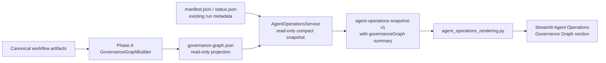

# NBS Governance Graph Phase B Design

狀態：approved for implementation planning
日期：2026-07-27
風險：R1 standard engineering
範圍：在既有 Streamlit `Agent Operations` 中新增只讀 Governance Graph view；只消費已存在的 Graph projection，不建立新的 workflow state 或控制入口。

## 1. 目的

Phase A 已完成 canonical workflow artifacts 到 `governance-graph.json` 的
deterministic projection。Phase B 讓工程使用者能在現有 Streamlit 應用的
`Agent Operations` 內，以 compact、可追溯且安全的視圖查看每個 workflow run 的
Governance Graph 狀態、lineage、freshness、blocker 與 bounded evidence 摘要。

此功能是治理觀測層，不是 workflow control plane。畫面只能解釋「已存在的
canonical artifacts 與 projection 表示什麼」，不能創造、修補、批准或推進任何
workflow 狀態。

## 2. 已確認的產品選擇

- 不建立獨立 application、FastAPI endpoint 或 Vue page；使用現有 Streamlit
  `Agent Operations` 作為入口。
- UI 以獨立 read model 與 rendering module 實作，不能讓 `app_pages.py` 直接
  讀 runtime JSON。
- Phase B 只讀取**已存在**的 `governance-graph.json` projection；手動 Refresh
  不能呼叫 `GovernanceGraphBuilder.build()` 或 `persist()`，也不能執行
  `scripts/governance_graph.py`。
- projection 缺失表示 `unavailable`／「尚無已建 Graph snapshot」，不是可由 UI
  自行補建的資料缺口。
- Graph 的 `allowedNextNodes` 只顯示合法選項提示；不得變成 approve、dispatch、
  repair、documentation apply、Git integration 或 R2 decision 的操作入口。
- Agent Operations 保持 session-scoped manual refresh；不加入 timer、polling、
  daemon 或 background worker。

## 3. Scope 與非目標

### 3.1 In scope

- 將每個合法 run 的既有 Graph projection 摘要納入
  `agent-operations-snapshot-v1`。
- 顯示 Graph overall status、freshness、節點狀態、blockers、bounded diagnostics
  與安全的 evidence 摘要。
- 在既有 run 詳情中提供 Graph section；run 沒有 projection 時提供明確 empty state。
- 對缺失、壞檔、schema error、symlink、oversize、identity mismatch 與 stale
  projection fail closed，並隔離單一壞 run。
- 加入 service、rendering 與既有 module-boundary regression tests。

### 3.2 Out of scope

- 新的 workflow database、daemon、queue、scheduler、FastAPI endpoint、Vue page
  或獨立 Streamlit process。
- Graph auto-build、auto-rebuild、persist、CLI invocation、approval、dispatch、
  repair、retry、prune、delete、documentation apply、commit、push 或 merge。
- 改動 Graph canonical mapping、risk router、authorization state machine、retry
  budget、Review/Hermes/Documentation ownership 或 retention policy。
- 顯示 raw JSON、完整 artifact、絕對路徑、runner command、prompt、stdout/stderr、
  secret、原始資料列、完整 log 或內部推理。
- 對 SQLite、upload、baseline、rollback、revenue scope、business rules、export
  schema、正式資料或 Git state 的寫入。

## 4. 架構與權責



| Component | Responsibility | Must not do |
|---|---|---|
| `GovernanceGraphBuilder` | Phase A build/validate/status contract | Phase B UI cannot invoke build or persist |
| `AgentOperationsService` | Safe allowlisted read of existing run artifacts and Graph projection; compact summary construction | Generic runtime file browser, projection write, workflow mutation |
| `agent_operations_rendering.py` | Render compact snapshot and session-only selection | Read files, parse raw schema, execute CLI or mutate state |
| `app_pages.py` | Reuse existing session snapshot lifecycle and manual refresh | Contain Graph parsing or create a second snapshot cache |

`governance-graph.json` remains a derived artifact and canonical artifacts remain the
only source of truth. A rendered Graph view never upgrades missing evidence into
`passed` and never overrides `status.json`.

## 5. Read Model Contract

### 5.1 Source and loading rules

`AgentOperationsService` adds one allowlisted optional projection per run:

```text
governance-graph.json
```

The service must use the same containment, `lstat`, symlink rejection, regular-file,
size-cap, object-JSON and bounded-diagnostic rules used by existing artifact readers.
It must not scan unknown filenames. A missing optional projection is normal and does
not invalidate a run.

The service must validate the projection with `GovernanceGraphSnapshot.from_dict()`
or an equivalently strict Phase A validator. It must not call `build()`, `persist()`,
or any writer. A malformed or unsafe projection is represented as a bounded Graph
state and must not prevent other valid runs from appearing. Freshness is rendered
only from the validated Phase A projection; Phase B does not independently infer a
fresh state from timestamps or reconstruct canonical lineage.

### 5.2 Compact `governanceGraph` field

Each `runs[]` item gains an optional compact field:

```json
{
  "governanceGraph": {
    "status": "available",
    "overallStatus": "awaiting_authorization",
    "freshness": "fresh",
    "nodeStatuses": [
      {"nodeId": "risk", "status": "passed", "reasonCode": null},
      {"nodeId": "review", "status": "not_started", "reasonCode": null}
    ],
    "blockers": [{"code": "stale_artifact", "nodeId": "hermes"}],
    "diagnostics": [],
    "evidence": [
      {"nodeId": "risk", "artifact": "risk-classification.json", "sha256": "...", "status": "passed"}
    ]
  }
}
```

The exact field names are finalized by the implementation plan, subject to these
invariants:

- `status` is one of `available`, `unavailable`, `blocked`, or `invalid`.
- `unavailable` is used only when the optional projection does not exist.
- `blocked`/`invalid` preserve a safe reason code or bounded diagnostic; they never
  claim a graph status that could not be validated.
- `freshness` comes from the validated projection; it is never inferred from file
  timestamp alone.
- Node summary preserves only node ID, status, reason code and capped evidence
  metadata. No raw payload is exposed.
- Evidence retains artifact basename, SHA-256 and status only when the Phase A
  projection already permits it. It excludes absolute paths and all sensitive content.
- Unknown projection fields are rejected by strict Phase A model validation; the UI
  does not create semantic edges that do not exist in the projection.

### 5.3 State semantics

| Source condition | UI meaning | UI action |
|---|---|---|
| valid projection | `available` with validated overall/node status | render Graph summary |
| no projection | `unavailable` | state that no Graph snapshot has been built; provide no build control |
| stale projection / stale descendant | `available` with `freshness=stale`, or validated blocked status | render as attention/blocker; never PASS |
| malformed schema or unsafe artifact | `invalid` / `blocked` with bounded diagnostic | isolate run Graph section |
| missing canonical artifact represented in projection | `not_started` or `blocked` as Phase A states | render exactly, do not infer relationship |

## 6. UI Design

The existing fourth top-level tab remains named `Agent Operations`. Governance Graph
is a section of selected-run details, not a separate top-level app or control page.

The selected-run Graph section contains:

1. **Graph summary** — overall status and freshness badge.
2. **Lineage table** — ordered Phase A nodes: Risk, Spec Gate, Plan Gate,
   Implementation, Targeted Verification, Review, Full Verification, Hermes,
   Documentation and Git Integration. Each row shows state and bounded reason.
3. **Blockers and diagnostics** — code plus safe summary only.
4. **Evidence drill-down** — capped list of artifact basename, evidence SHA-256
   short form and evidence status. It is informational, not a download or raw-data
   control.
5. **Unavailable/invalid state** — explains why the UI has no usable snapshot
   without inviting the user to rebuild it from the page.

Normal Streamlit reruns reuse `AGENT_OPERATIONS_SNAPSHOT`. Only the existing manual
Refresh reconstructs the compact read model; it must preserve dashboard, AI, export
and upload session caches. Refresh still reads only; it never rebuilds projection.

## 7. Security, Privacy and Governance Boundaries

- `AgentOperationsService` remains the only runtime-artifact reader for the UI.
- The project-root and run-root containment rules remain fail closed; symlink,
  traversal, non-regular file and size-cap failures are isolated with bounded
  diagnostics.
- No Graph field may include absolute path, arbitrary filename, command, prompt,
  raw stdout/stderr, exception payload, secret, raw row or full log.
- `allowedNextNodes` is a descriptive field only and must not create buttons,
  approval affordances or automatic navigation.
- Review Agent and Hermes retain their existing responsibilities. A green Graph
  node cannot be treated as Review PASS, full verification PASS or Hermes PASS
  outside the canonical evidence it summarizes.
- Formal revenue scope remains `不含掛賬核銷與TT退款轉團款`; the 2026-05 frozen
  baseline remains `HKD 12,057,968`. The Graph view cannot calculate, override or
  reinterpret either value.

## 8. Error Handling

- Empty runtime returns the existing valid empty Agent Operations snapshot.
- A run missing Graph projection remains visible with Graph `unavailable`.
- A malformed or unsafe Graph projection does not hide valid non-Graph run data;
  it adds only a bounded Graph diagnostic for that run.
- One broken run must not stop valid runs from rendering.
- Renderer input with an unknown compact Graph state displays a safe unavailable
  message, not an exception or raw payload.
- A rendering/service failure in Graph details must not white-screen other Streamlit
  tabs or trigger runtime writes.

## 9. Test and Acceptance Strategy

### 9.1 Focused tests

Service coverage must prove:

- valid projection is compacted from an existing `governance-graph.json`;
- service never calls Graph build/persist and does not create runtime directories;
- missing projection produces `unavailable`, not inferred graph state;
- malformed JSON/schema, symlink, non-regular file and oversize projection are
  rejected safely;
- a persisted stale Graph snapshot / stale descendant renders as non-PASS evidence;
- one invalid Graph projection does not suppress a second valid run;
- no absolute path, raw artifact payload, command, prompt or log leaks.

Rendering coverage must prove:

- valid summary, lineage, blockers, evidence and unavailable/invalid states render;
- only bounded compact fields are consumed;
- manual Refresh rebuilds the read model, while ordinary reruns reuse session state;
- Graph rendering does not clear dashboard, AI, export or upload session cache;
- existing Agent Operations and top-level tab order regressions remain valid.

### 9.2 Final acceptance

Because this is R1 cross-module UI/read-model work, final acceptance includes:

```bash
.venv/bin/python -m py_compile backend/services/agent_operations_service.py agent_operations_rendering.py app_pages.py
.venv/bin/python -m pytest tests/test_governance_graph_service.py tests/test_agent_operations_service.py tests/test_agent_operations_rendering.py tests/test_app_module_boundaries.py -q
.venv/bin/python -m pytest -q
.venv/bin/python scripts/system_manager.py acceptance
.venv/bin/python scripts/hermes_post_change_check.py --skip-monitor --json
```

Before and after the work, record the formal SQLite SHA-256 and verify the frozen
2026-05 baseline remains `HKD 12,057,968`. Any Hermes degraded, timeout or failure
blocks completion and must be reported with the failed stage, actual error and the
next smallest repair action.

## 10. Completion Definition

Phase B is complete only when a user can manually refresh the existing Agent
Operations tab and safely inspect valid Governance Graph projection summaries,
lineage, evidence references, stale/missing/blocked reasons, without any UI path
that mutates workflow state, projection, Git, SQLite, baseline or runtime. Focused
tests, full verification, system acceptance, Hermes and frozen-baseline/SQLite
integrity checks must all pass.

## 11. Deferred Follow-ups

The following remain future P2/P3 work and require separate design decisions:

- version comparison across Graph snapshots;
- read-only export of Graph summaries;
- dependency/impact analysis beyond Phase A canonical edges;
- GitHub PR and commit lineage enrichment;
- a separate authenticated API or a standalone visualization application.
