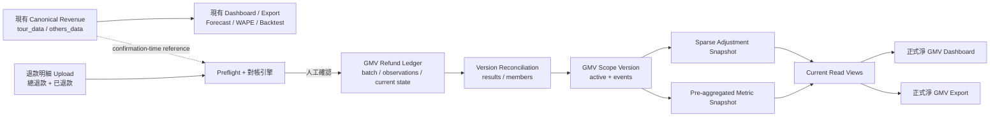

# 正式淨 GMV SQLite Ledger 設計

**日期：** 2026-08-20
**狀態：** 設計已於對話中逐段批准，等待 written spec review
**範圍：** 正式淨 GMV 的 SQLite 持久化、版本化生效、Dashboard read model 與完整報表匯出

## 1. 目的

把目前 GMV 排除訂單看板的 session-only 退款扣減視角，升格為第二套正式業務口徑，同時保留現有正式營收口徑。

兩套正式口徑並列：

1. **現有正式營收**：不含掛賬核銷與 TT 退款轉團款；現有 Dashboard、Export、Forecast、WAPE、Backtest 與 2026-05 frozen baseline `HKD 12,057,968` 保持不變。
2. **正式淨 GMV**：以上述正式營收為基礎，只扣減退款狀態精確等於「已退款」且正式匹配的退款金額。

「總退款」繼續保留在 GMV Dashboard 與完整報表中，作為退款營運監控維度，但不驅動正式淨 GMV。

## 2. 已批准決策

- 使用同一個 SQLite 檔案，以 `gmv_` table/view 前綴建立獨立邏輯資料區。
- 不覆寫 `tour_data`、`others_data` 或任何原始收款金額。
- 採用雙期間口徑：
  - 正式淨 GMV 把退款扣回原訂單／原收款月份。
  - 退款營運分析另按實際退款月份呈現。
- 採用 `Preflight → 人工確認 → 版本化生效 → 可回滾`。
- 每次退款檔視為增量 observation；以 `退款單號` 作穩定業務鍵，支援同一退款由「退款中」變為「已退款」。
- 原始 observations append-only；另外維護每個退款單號的 latest-state projection。每個 GMV version 以全部 latest states 計算，不只計算本次檔案。
- 第一階段只接入 GMV Dashboard 與完整報表匯出。
- 第一階段不接入 AI Forecast、Daily WAPE、Macro Backtest 或現有 frozen baseline。
- 退款計算只在確認／切換版本的 write path 執行；頁面只讀取 active snapshot。
- 現有首頁 page-load hot path 不得新增 GMV query、migration、退款計算或 cache invalidation。

## 3. 現況與問題

目前退款流程已具備：

- 退款檔 schema、狀態、金額與重複資料 Preflight。
- `總退款` 與 `已退款`兩個維度。
- 正式匹配、收入規則排除、SQLite 找不到及超額退款分類。
- 按來源單據號彙總退款、按原收款列比例分配及以原收款金額為上限。
- GMV Dashboard、異常中心及完整退款扣減報表。

目前限制是結果只存在 Streamlit session，不具備正式批次、版本、啟用歷史、可回滾 snapshot 或穩定 read contract。

對實際 `退款明細數據.xlsx` 的唯讀 schema 檢查顯示：1,000 筆資料的 `退款單號` 全部非空且唯一；`來源單據號` 只有 865 個唯一值。因此 `退款單號` 可作 refund identity，`來源單據號` 只作營收匹配與多筆退款彙總，不能作退款主鍵。正式狀態使用 E 欄 `退款状态`；`退款單狀態` 另作來源稽核欄位保存。

## 4. 範圍

### 4.1 Included

- GMV SQLite schema 與顯式 migration。
- 退款批次、append-only observations、current-state projection 及版本對帳結果持久化。
- 正式淨 GMV scope version、active pointer、activation/rollback event。
- 稀疏扣減 snapshot 與 Dashboard 預聚合 metric snapshot。
- Stable current views。
- Streamlit 人工確認、生效 receipt、版本資訊及 rollback 操作。
- 正式淨 GMV Dashboard 與完整報表匯出。
- Data parity、transaction、migration、performance、UI 與 export 驗收。

### 4.2 Excluded

- 修改現有正式營收定義或 2026-05 frozen baseline。
- 把正式淨 GMV 接入 Forecast、WAPE 或 Backtest。
- 建立第二個 SQLite 檔案、外部資料庫或外部服務。
- Governance Graph、Memory Hub、Agent orchestration 或新的通用 approval/workflow subsystem。
- 自動確認退款批次；正式生效必須由人工作出明確確認。
- 直接修改或刪除已確認批次、退款明細、對帳結果、snapshot 或 event。

## 5. 架構

SQLite 沒有 PostgreSQL 式 schema namespace，因此以 `gmv_` 前綴、repository boundary、write contract 與索引形成邏輯分區。

## 6. 資料模型

所有金額在新 `gmv_` tables 以 `INTEGER` minor units 保存；HKD 1.00 保存為 `100`，避免 SQLite `REAL` 累積誤差。日期以 ISO-8601 `TEXT` 保存。ID 使用不可變 UUID/ULID `TEXT`。

### 6.1 `gmv_refund_batches`

一筆代表一次已確認的增量退款批次。Preflight 階段只使用 session/temp artifact；人工確認時才在正式 transaction 建立批次。

主要欄位：

- `batch_id TEXT PRIMARY KEY`
- `source_filename TEXT NOT NULL`
- `file_sha256 TEXT NOT NULL`
- `normalized_sha256 TEXT NOT NULL`
- `source_row_count INTEGER NOT NULL`
- `valid_row_count INTEGER NOT NULL`
- `preflight_status TEXT NOT NULL`
- `preflight_fingerprint TEXT NOT NULL`
- `warning_acknowledgement_json TEXT NOT NULL`
- `revenue_generation_token TEXT NOT NULL`
- `rule_version TEXT NOT NULL`
- `confirmed_at TEXT NOT NULL`
- `confirmed_by TEXT NOT NULL`

`file_sha256` 參與重複確認判斷。confirmed batch 不允許 update/delete。

約束：`UNIQUE(file_sha256, revenue_generation_token)`。同一檔案與同一收入 generation 不得重複確認；收入 generation 改變時，可使用相同檔案重新驗證或改用 current-state rebuild。

### 6.2 `gmv_refund_observations`

append-only 保存每次上傳看到的標準化退款狀態。歷史 observation 不 update/delete。

主要欄位：

- `observation_id TEXT PRIMARY KEY`
- `batch_id TEXT NOT NULL REFERENCES gmv_refund_batches(batch_id)`
- `source_row_number INTEGER NOT NULL`
- `source_row_sha256 TEXT NOT NULL`
- `refund_order_no TEXT NOT NULL`
- `source_receipt_no TEXT NOT NULL`
- `refund_order_status TEXT`
- `refund_status TEXT NOT NULL`
- `refund_amount_minor INTEGER NOT NULL`
- `currency_code TEXT NOT NULL DEFAULT 'HKD'`
- `refund_date TEXT`
- `original_order_period TEXT`
- `observed_at TEXT NOT NULL`

約束：`UNIQUE(batch_id, refund_order_no)` 及 `UNIQUE(batch_id, source_row_sha256)`。A 欄 `退款單號` 是 refund identity；E 欄 `退款状态` 是正式淨 GMV 判斷狀態。原始中文值保留。

### 6.3 `gmv_refund_current`

保存每個退款單號的 latest-state projection，供新 GMV version 讀取。

主要欄位：

- `refund_order_no TEXT PRIMARY KEY`
- `current_observation_id TEXT NOT NULL REFERENCES gmv_refund_observations(observation_id)`
- `source_receipt_no TEXT NOT NULL`
- `refund_order_status TEXT`
- `refund_status TEXT NOT NULL`
- `refund_amount_minor INTEGER NOT NULL`
- `currency_code TEXT NOT NULL`
- `refund_date TEXT`
- `first_seen_batch_id TEXT NOT NULL`
- `last_seen_batch_id TEXT NOT NULL`
- `state_sha256 TEXT NOT NULL`
- `updated_at TEXT NOT NULL`

同一退款單號再次出現時：

- state hash 相同：保存 observation，但 current projection 不變。
- 只有退款狀態改變：更新 current projection，並在下一版本反映。
- 金額、來源單據號或幣種改變：列為 `REFUND_IDENTITY_CONFLICT` warning，明確確認後才更新 current projection。

增量檔未出現的既有退款不代表刪除，`gmv_refund_current` 必須保留其 latest state。只有同一 `退款單號` 的新 observation 才能改變 current state。

`refund_state_sha256` 由全部 current rows 按標準化 `退款單號` 排序後，對 `退款單號、來源單據號、退款狀態、退款金額、幣種、退款日期` 的 canonical serialization 計算；不包含 batch time 或其他非業務欄位。

### 6.4 `gmv_reconciliation_results`

一筆代表一個 GMV version、一個來源單據號及一個退款維度的聚合對帳結果。它使用全部 `gmv_refund_current`，而非只使用 trigger batch。

主要欄位：

- `result_id TEXT PRIMARY KEY`
- `version_id TEXT NOT NULL REFERENCES gmv_scope_versions(version_id)`
- `source_receipt_no TEXT NOT NULL`
- `refund_dimension TEXT NOT NULL`：`TOTAL_REFUND` 或 `REFUNDED`
- `match_status TEXT NOT NULL`：`FORMAL_MATCHED`、`REVENUE_SCOPE_EXCLUDED` 或 `SQLITE_SOURCE_NOT_FOUND`
- `reason_code TEXT NOT NULL`
- `refund_detail_amount_minor INTEGER NOT NULL`
- `original_receipt_amount_minor INTEGER NOT NULL`
- `applied_refund_amount_minor INTEGER NOT NULL`
- `over_refund_amount_minor INTEGER NOT NULL`
- `refund_row_count INTEGER NOT NULL`
- `revenue_generation_token TEXT NOT NULL`
- `rule_version TEXT NOT NULL`

正式淨 GMV 只讀取 `refund_dimension='REFUNDED' AND match_status='FORMAL_MATCHED'`。`TOTAL_REFUND`、被規則排除及找不到資料只供營運分析與稽核。

### 6.5 `gmv_reconciliation_members`

保存聚合對帳結果使用了哪些 latest refund observations，讓正式數字可追溯至退款單號。

主要欄位：

- `result_id TEXT NOT NULL REFERENCES gmv_reconciliation_results(result_id)`
- `refund_order_no TEXT NOT NULL`
- `observation_id TEXT NOT NULL REFERENCES gmv_refund_observations(observation_id)`
- `contributed_amount_minor INTEGER NOT NULL`

主鍵：`(result_id, refund_order_no)`。

### 6.6 `gmv_scope_versions`

保存一次可重現的正式淨 GMV 計算版本。

主要欄位：

- `version_id TEXT PRIMARY KEY`
- `trigger_batch_id TEXT`
- `previous_version_id TEXT`
- `revenue_generation_token TEXT NOT NULL`
- `refund_state_sha256 TEXT NOT NULL`
- `rule_version TEXT NOT NULL`
- `calculation_sha256 TEXT NOT NULL UNIQUE`
- `status TEXT NOT NULL`：`ACTIVE` 或 `RETIRED`
- `activated_at TEXT NOT NULL`
- `activated_by TEXT NOT NULL`

使用 partial unique index 保證同一時間最多一筆 `status='ACTIVE'`。版本只可由 activation transaction 改變 active/retired 狀態。

`trigger_batch_id` 在退款批次確認時指向該 batch；只因 revenue generation 改變而重建時可為空。`refund_state_sha256` 是全部 current-state rows 的 canonical checksum。

`calculation_sha256` 由 revenue generation、refund-state checksum、rule version、reconciliation checksum、adjustment snapshot checksum 與 metric snapshot checksum 組成，確保相同輸入與規則產生 deterministic version identity。

### 6.7 `gmv_adjustment_snapshot`

只保存受退款影響的正式收款列，不複製未受影響的 `tour_data`／`others_data`。

主要欄位：

- `version_id TEXT NOT NULL`
- `source_table TEXT NOT NULL`
- `source_row_fingerprint TEXT NOT NULL`
- `source_receipt_no TEXT NOT NULL`
- `original_order_period TEXT NOT NULL`
- `refund_period TEXT`
- `refund_before_amount_minor INTEGER NOT NULL`
- `applied_refund_amount_minor INTEGER NOT NULL`
- `refund_after_amount_minor INTEGER NOT NULL`
- `allocation_ratio_ppm INTEGER NOT NULL`
- `branch_code TEXT`
- `salesperson_key TEXT`
- `business_type TEXT`

主鍵：`(version_id, source_table, source_row_fingerprint)`。`allocation_ratio_ppm` 以百萬分比整數保存，snapshot 金額仍以實際分配後 minor units 為真相。

### 6.8 `gmv_metric_snapshot`

保存 GMV Dashboard 所需的預聚合結果。

主要欄位：

- `version_id TEXT NOT NULL`
- `period_basis TEXT NOT NULL`：`ORIGINAL_ORDER` 或 `REFUND_EVENT`
- `period_key TEXT NOT NULL`
- `dimension_type TEXT NOT NULL`
- `dimension_key TEXT NOT NULL`
- `dimension_label TEXT NOT NULL`
- `refund_dimension TEXT NOT NULL`
- `metric_name TEXT NOT NULL`
- `metric_amount_minor INTEGER NOT NULL`
- `metric_count INTEGER NOT NULL`

主鍵覆蓋上述 grain。首頁排名、月度趨勢、分社、銷售代表與業務類型只查這張小型 read model。

### 6.9 `gmv_scope_events`

append-only 稽核事件表。

主要欄位：

- `event_id TEXT PRIMARY KEY`
- `event_type TEXT NOT NULL`：`ACTIVATE`、`ROLLBACK` 或 `DEACTIVATE`
- `from_version_id TEXT`
- `to_version_id TEXT`
- `reason TEXT NOT NULL`
- `actor TEXT NOT NULL`
- `created_at TEXT NOT NULL`
- `event_sha256 TEXT NOT NULL UNIQUE`

Rollback 只切換 active version 並新增事件，不刪除任何 ledger 或 snapshot 資料。第一個版本無可回切版本時，可 `DEACTIVATE` 至安全 empty state。

### 6.10 Stable views

- `v_gmv_current_metrics`：只返回 active version 的 metric snapshot。
- `v_gmv_current_adjustments`：只返回 active version 的 adjustment snapshot。
- `v_gmv_current_scope`：返回 active version、trigger batch、revenue generation、refund-state checksum、rule version、啟用時間及 calculation checksum。

Consumer 不直接查詢 retired version，也不自行判斷哪個版本有效。

如果 active version 的 `revenue_generation_token` 與目前正式營收 generation 不一致，Application service 必須把正式淨 GMV 標記為 `STALE_REVENUE_GENERATION`，不得以 current formal value 呈現。使用者可從全部 refund current state 重建新版本，不需重新上傳歷史退款。

### 6.11 必要索引

- `gmv_refund_observations(batch_id, refund_order_no)`
- `gmv_refund_observations(refund_order_no, observed_at)`
- `gmv_refund_current(source_receipt_no, refund_status)`
- `gmv_reconciliation_results(version_id, refund_dimension, match_status)`
- `gmv_reconciliation_members(result_id, refund_order_no)`
- `gmv_adjustment_snapshot(version_id, original_order_period)`
- `gmv_adjustment_snapshot(version_id, refund_period)`
- `gmv_metric_snapshot(version_id, period_basis, period_key, dimension_type)`
- `gmv_scope_versions(status)` partial unique active index

## 7. Write contract

UI 不得直接執行 SQL。Application service/repository 提供四個業務操作。

### 7.1 Preflight

`preview_gmv_refund_batch(file)`：

- 解析並標準化退款檔。
- 以 `退款單號` 與 `gmv_refund_current` 比較，分類 `NEW`、`UNCHANGED`、`STATUS_CHANGED` 或 `REFUND_IDENTITY_CONFLICT`。
- 使用「既有 current state + 本批次擬議變更」執行總退款／已退款對帳引擎，而不是只計算本次檔案。
- 返回 file hash、normalized hash、projected refund-state hash、preflight fingerprint、revenue generation token、rule version、change summary、warnings、兩個退款維度及 exception rows。
- 不寫入正式 `gmv_` tables，不改 active version。

### 7.2 Confirm and activate

`confirm_gmv_refund_batch(preflight_token, warning_acknowledgement, actor)`：

1. 取得既有 shared write lease。
2. 重新驗證 file hash、normalized hash、preflight fingerprint、rule version 與 revenue generation token。
3. 檢查 `(file_sha256, revenue_generation_token)` 尚未確認。
4. 開始單一 SQLite transaction。
5. 寫入 batch 及 append-only observations。
6. 對 `NEW`、`STATUS_CHANGED` 及已明確認可的 `REFUND_IDENTITY_CONFLICT` 更新 `gmv_refund_current`；`UNCHANGED` 不更新 projection。
7. 從全部 current-state refunds 建立 reconciliation results/members、version、adjustment snapshot、metric snapshot 及 activation event。
8. 把上一個 active version 改為 retired，將新版本改為 active。
9. 驗證 projected refund-state hash、snapshot checksum 與唯一 active 約束。
10. Commit 後只更新 GMV generation token。

任一步失敗必須 rollback 整個 transaction；上一個 active version 與現有正式營收完全不變。

如果批次只有 `UNCHANGED`，且 active version 已使用同一 revenue generation、refund-state hash 與 rule version，確認結果為 deterministic `no_change`，不建立重複 version。

### 7.3 Rebuild against latest revenue

`rebuild_gmv_scope(reason, actor)`：

- 不需要重新上傳歷史退款檔。
- 以全部 `gmv_refund_current`、最新 revenue generation 及目前 rule version 重新執行對帳並建立 snapshot。
- 如果計算 checksum 與現有 active version 相同，返回 `no_change`。
- 使用與 confirmation 相同的 shared lease、transaction、checksum 及 activation event gate。

### 7.4 Rollback / deactivate

`rollback_gmv_scope(target_version_id, reason, actor)`：

- 需要明確 target、原因及操作者。
- 只允許切換至完整且 checksum 驗證通過的既有版本。
- 在單一 transaction 切換 active/retired 並新增 `ROLLBACK` event。
- 不重新計算、不刪資料、不改現有正式營收 generation。
- 第一個版本沒有 previous version 時，允許明確 `DEACTIVATE` 至安全 empty state並新增 event。

第一版停用使用 `deactivate_gmv_scope(reason, actor)`；它把目前 active version 改為 retired、建立 `DEACTIVATE` event，並使 current views 返回 empty state。

## 8. Blocking 與 warning 規則

### 8.1 Blocking

- 缺少必要欄位或沒有可用退款列。
- file hash、normalized hash 或 preflight fingerprint 不一致。
- revenue generation token 已改變；必須重新 Preflight。
- 同一 `(file_sha256, revenue_generation_token)` 已確認。
- 缺少或重複 `退款單號`，無法建立 deterministic identity。
- 無法取得 shared write lease。
- snapshot checksum、唯一 active 約束或 transaction 寫入失敗。

### 8.2 Warning，可人工確認

- SQLite 找不到來源單據號。
- 被現有正式收入規則排除。
- 重複退款列、未知退款狀態或超額退款。
- 同一退款單號的金額、來源單據號或幣種改變（`REFUND_IDENTITY_CONFLICT`）。
- 正式匹配率偏低。

確認時必須保存 warning acknowledgement。`REFUND_IDENTITY_CONFLICT` 必須逐筆或整批明確認可；未認可不得更新 current projection。未知狀態只進 `TOTAL_REFUND`，不進 `REFUNDED` 或正式淨 GMV。

## 9. Read contract 與 Dashboard

第一階段 UI 顯示兩套正式 KPI：

- 現有正式營收。
- 正式淨 GMV（只扣已退款）。

GMV Dashboard 同時呈現：

- active version、trigger batch（如有）、contributing batches、啟用時間、收入 generation 及 rule version。
- 正式營收、已退款實際扣減、正式淨 GMV。
- 總退款與已退款並列。
- 原訂單月份的正式淨 GMV 趨勢。
- 退款月份的退款營運趨勢。
- 分社、銷售代表、業務類型排名。
- 匹配、規則排除、找不到、超額退款及 warning 摘要。
- 本次批次的新增、未變、更改狀態及 identity conflict 數量。

若沒有 active version，GMV 正式區顯示「尚未建立正式淨 GMV 版本」，但現有 Dashboard 照常載入。

若 active version 的 revenue generation 已過期，GMV 正式區顯示 `STALE_REVENUE_GENERATION` 與「使用目前退款狀態重建」動作；過期 snapshot 可供稽核查看，但不得標示為目前正式淨 GMV。

為保證現有首頁效能，第一階段 GMV 正式區採明確的「載入正式淨 GMV」使用者動作；該動作前不呼叫 GMV repository。這也避免 Streamlit `st.tabs` eager execution 把 GMV query 放入現有首頁 hot path。

## 10. Export contract

完整退款扣減版報表保留：

- `總退款` 完整報表。
- `已退款` 完整報表。

正式淨 GMV sheet 與正式摘要只使用「已退款」。總退款只作營運比較，不以正式淨 GMV標示。

每份 workbook 必須包含或標示：

- active `version_id`、trigger batch（如有）、全部 contributing refund batches、收入 generation、refund-state checksum、rule version、calculation checksum。
- 原訂單月份與退款月份兩種期間欄位。
- 退款明細金額、實際扣減金額及超額退款金額。
- 匹配狀態與 reason code。
- 「總退款」或「已退款」退款維度。

Workbook 只在使用者按下載時生成，並以 `(version_id, export_schema_version)` 作 cache key；生成 workbook 不屬於 page-load hot path。

## 11. Migration 與資料保護

- Migration 必須是顯式 deployment/maintenance command，不得在 module import、Streamlit render 或一般 page load 自動執行。
- 執行前使用既有 SQLite backup 機制建立可驗證備份。
- DDL 在 transaction 內執行，完成後檢查 table/view/index fingerprint、foreign keys 及 `PRAGMA integrity_check`。
- Migration 必須可重複檢查；schema 已正確時為 deterministic no-op。
- 初次 migration 不建立 active version，也不改任何現有營收資料或 baseline。
- 正式啟用前先以 temp SQLite fixture 跑完整 migration 與 rollback acceptance。
- 既有 session-only 退款檔不自動導入；第一個正式批次必須經過同一 Preflight 與人工確認。

## 12. Cache 與效能

### 12.1 結構 Gate

- 現有首頁與經營分析大盤不得呼叫 GMV repository。
- 現有 revenue cache token 不因 GMV activation 改變。
- GMV token 只在 successful activate/rollback/deactivate commit 後更新。
- Refund calculation、metric aggregation、snapshot build 只在 confirmation 或明確 rebuild write path 執行。
- GMV Dashboard 只查 indexed `v_gmv_current_metrics`。
- revenue generation 改變不在現有 upload/page-load hot path 自動重建 GMV；只在使用者載入 GMV 區時檢查 token，並由明確 rebuild action 執行。

### 12.2 Benchmark Gate

在同一機器、同一 SQLite、同一 warm-cache 條件下，變更前後各執行 10 次：

- 現有首頁 median page-load regression 同時不得超過 `300 ms` 及基準的 `5%`。
- Contract/query spy 必須證明現有首頁產生 `0` 次 GMV repository call。
- active GMV metric snapshot indexed query 目標 `< 100 ms`。
- GMV 看板資料準備目標 `< 1.5 s`，不含 Excel workbook 生成。
- Snapshot row count 必須等於受退款影響的正式收款列，不得複製未受影響營收列。

如果 benchmark 未通過，本功能不得宣稱完成或進入正式 activation。

## 13. 測試與驗收

### 13.1 Unit

- 總退款與已退款狀態選擇。
- 退款單號 NEW、UNCHANGED、STATUS_CHANGED 及 REFUND_IDENTITY_CONFLICT。
- 同一退款由退款中變成已退款後，只在新 active version 開始扣減。
- 增量檔未出現的既有退款仍保留在 current-state projection。
- 正式淨 GMV 只扣已退款。
- 原訂單月份與退款月份雙期間 C。
- 同一來源單據多筆退款彙總。
- 多收款列比例分配與 minor-unit rounding 守恆。
- cap、超額退款、規則排除與找不到分類。

### 13.2 Repository / migration

- 新 DB migration、既有 DB migration、重複 migration no-op。
- backup、schema fingerprint、foreign keys 與 integrity check。
- duplicate file、stale generation、stale fingerprint、shared lease 失敗。
- append-only observation history、current projection upsert、no-change batch 與 identity conflict acknowledgement。
- revenue generation stale detection 與 current-state rebuild。
- atomic commit、故障注入 rollback、唯一 active version。
- activate/rollback/deactivate event append-only。
- confirmed ledger 禁止 update/delete。

### 13.3 Parity

同一份退款檔、同一 revenue generation：

- 新正式淨 GMV 的已退款扣減結果，必須與既有 session-only 已退款引擎一致。
- 總退款、已退款、實際扣減、超額退款及 exception rows 必須對得上。

### 13.4 Dashboard / Export

- 雙正式口徑並列且標籤清楚。
- 總退款保留，但不誤標為正式淨 GMV。
- active version provenance 完整。
- 沒有 active version 時 fail-safe empty state。
- Workbook 同時包含總退款與已退款，正式 sheet 只使用已退款。
- Audit sheet 可追溯至 batch、version、generation 與 checksum。
- 同一退款單號的狀態歷史可由 current projection 追回全部 observations。

### 13.5 Performance / release

- 首頁 query contract 與 10-run benchmark 通過。
- GMV indexed query 與看板資料準備時間通過。
- Targeted tests 通過。
- Findings-first Review PASS。
- Full pytest PASS。
- Hermes read-only acceptance PASS。
- 實際 Streamlit UI 驗收通過。

## 14. Rollout

1. 在 temp SQLite 完成 migration、repository 與故障注入測試。
2. 在正式 DB 建立 backup，執行顯式 migration；此時沒有 active version，現有頁面不變。
3. 啟用只讀 GMV repository health 與 empty state。
4. 使用已知退款檔完成 Preflight，核對退款單號唯一性、current-state projection 與 session-only parity。
5. 人工確認第一個正式版本，生成 activation receipt。
6. 驗收 Dashboard、兩套完整報表、效能 benchmark、full pytest 與 Hermes。
7. 若正式結果有問題，切回上一個 active version；第一版沒有上一版本時，將 GMV 正式視角停用為 empty state，現有正式營收仍不受影響。

## 15. 完成定義

以下條件全部成立才算完成：

1. 現有正式營收、baseline、Forecast、WAPE 與 Backtest 數字未改變。
2. 正式淨 GMV 只扣減已退款，總退款仍可在 Dashboard 與 Export 查看。
3. 任一正式數字可追溯至 batch、observation、current state、reconciliation member、version、snapshot 與 activation event。
4. stale、重複或 transaction 失敗均 fail closed，舊 active version 保持可用。
5. 現有首頁無 GMV repository call，效能 Gate 通過。
6. Migration、targeted tests、Review、full pytest、Hermes 與實際 UI 驗收全部通過。
